# Scripts UNIGEO / CEMTEC — Monitoramento meteorológico de Mato Grosso do Sul

Produtos meteorológicos gerados a partir dos dados horários das **estações automáticas do INMET** em Mato Grosso do Sul, com **planilhas Excel** e **mapas** (pontuais e interpolados).

| Produto | O que gera |
|---|---|
| [`relatorio_inmet`](#produto-relatorio_inmet) | Extremos de temperatura, umidade e rajada e chuva acumulada de cada estação: planilha Excel e mapas |
| [`risco_fogo`](#produto-risco_fogo) | Risco meteorológico de fogo pela regra 30-30-30, avaliada hora a hora: planilha Excel e mapas de nível de risco |

Desenvolvido pela equipe de meteorologia do **CEMTEC** — Centro de Monitoramento do Tempo e do Clima de Mato Grosso do Sul (SEMADESC).

---

## Sumário

- [Como usar](#como-usar)
  - [Primeiros passos](#primeiros-passos)
  - [Como rodar um produto](#como-rodar-um-produto)
  - [Produto `relatorio_inmet`](#produto-relatorio_inmet)
  - [Produto `risco_fogo`](#produto-risco_fogo)
- [Requisitos](#requisitos)
- [Instalação](#instalação)
- [Configuração](#configuração)
- [Testes](#testes)
- [Novos produtos](#novos-produtos)
- [Estrutura do repositório](#estrutura-do-repositório)

---

## Como usar

### Primeiros passos

1. Instale o Python e as dependências (veja [Instalação](#instalação)).
2. Configure o token do INMET no arquivo `.env` (veja [Configuração](#configuração)).
3. Escolha o produto e o período, e rode o `main.py` como explicado abaixo.

### Como rodar um produto

Todos os produtos são gerados pelo mesmo arquivo, o [`main.py`](main.py). Há duas formas de dizer **qual produto** gerar e **de quando** são os dados.

**1. Pela linha de comando** (sem editar nada):

```bash
python main.py --produto relatorio_inmet --inicio 15/09/2026
```

| Opção | O que faz | Exemplo |
|---|---|---|
| `--produto` | Escolhe o produto | `--produto risco_fogo` |
| `--inicio` | Data inicial (DD/MM/AAAA) | `--inicio 15/09/2026` |
| `--fim` | Data final; se omitida, igual à inicial | `--fim 20/09/2026` |
| `--hrini` | Hora de início, no horário de MS (0 a 24) | `--hrini 8` |
| `--hrfim` | Hora de fim, no horário de MS (0 a 24) | `--hrfim 18` |
| `--tempo-real` | Últimas 24 horas até o momento em que roda | `--tempo-real` |
| `--hrtodas` | Só para o `risco_fogo`: gera o mapa de todas as horas | `--hrtodas` |

As horas aceitam `8`, `08h` ou `08:00`. Para ver todas as opções: `python main.py --help`.

**2. Editando o topo do `main.py`** e rodando só `python main.py`:

```python
PRODUTO = "relatorio_inmet"
DATA_INICIAL = date(2026, 8, 1)
DATA_FINAL = date(2026, 8, 31)
HORA_INICIAL = None  # opcional: hora de início (0 a 24); None = 00 h
HORA_FINAL = None    # opcional: hora de fim (0 a 24); None = 24 h
```

O que a linha de comando não informar é lido dessas variáveis.

#### Os três modos de tempo

O modo é definido pelas datas:

| Modo | Como pedir | Janela de tempo (horário de MS) |
|---|---|---|
| **Data específica** | `--inicio 15/09/2026` (ou `DATA_INICIAL` igual a `DATA_FINAL`) | O dia, da 00 h às 24 h |
| **Período** | `--inicio 01/08/2026 --fim 31/08/2026` (ou datas diferentes) | Da 00 h da data inicial às 24 h da data final |
| **Tempo real** | `--tempo-real` (ou as duas datas `None`) | As últimas 24 horas, até o momento em que roda |

Com `--hrini` e `--hrfim`, a janela passa a começar e terminar nessas horas — por exemplo, `--inicio 14/09/2026 --hrini 8 --fim 15/09/2026 --hrfim 8` cobre das 08 h de 14/09 às 08 h de 15/09. O modo continua definido pelas datas (mesmo dia = data específica; datas diferentes = período). As horas não valem com `--tempo-real`.

**`--produto` e o modo de tempo são independentes.** O `--produto` diz *o que* gerar; `--inicio`/`--fim` ou `--tempo-real` dizem *de quando* são os dados. Qualquer produto pode ser combinado com qualquer modo que ele aceite:

| Produto | Data específica | Período | Tempo real |
|---|:---:|:---:|:---:|
| `relatorio_inmet` | ✅ | ✅ | ✅ |
| `risco_fogo` | ✅ | — | ✅ |

#### Onde ficam os resultados

Cada execução cria uma pasta própria dentro de `saida/`, separada por produto e por modo: `saida/<produto>/<modo>/<datas>/`. O nome da última pasta indica a janela consultada, no horário de MS:

| Consulta | Pasta |
|---|---|
| Data específica | `dia/20260915/` |
| Período | `periodo/20260801_a_20260831/` |
| Com horas | `periodo/20260914_08h_a_20260915_08h/` |
| Tempo real (rodado às 16h10 de 16/09) | `tempo_real/20260916_1610/` |

O conteúdo de `saida/` fica fora do controle de versão. O que cada produto grava nessa pasta está na seção **Saídas** de cada um, abaixo.

---

### Produto `relatorio_inmet`

Relatório de extremos e chuva das estações automáticas do INMET em MS.

#### O que calcula

Para cada estação automática de MS, na janela consultada:

| Variável | O que é calculado | Aba da planilha |
|---|---|---|
| Temperatura mínima | Menor valor, com data e hora | `Temp_Min` |
| Temperatura máxima | Maior valor, com data e hora | `Temp_Max` |
| Umidade relativa mínima | Menor valor | `Umidade` |
| Rajada de vento | Maior rajada (km/h) e a direção registrada no mesmo horário | `Vento` |
| Chuva | Acumulado na janela (no tempo real, em várias janelas) | `Chuva` |

Passo a passo de uma execução:

1. Consulta a lista de estações automáticas do INMET e filtra as de MS.
2. Baixa a série horária de cada estação pela API do INMET.
3. Calcula os extremos e os acumulados de cada variável.
4. Gera a planilha Excel com uma aba por variável, ordenada pelo valor.
5. Gera os mapas com o limite estadual, os municípios, o ranking dos 5 maiores (ou menores) valores e os logos institucionais.

#### Como rodar

```bash
python main.py --produto relatorio_inmet --inicio 15/09/2026                                   # data específica
python main.py --produto relatorio_inmet --inicio 01/08/2026 --fim 31/08/2026                  # período
python main.py --produto relatorio_inmet --inicio 14/09/2026 --hrini 8 --fim 15/09/2026 --hrfim 8  # com horas
python main.py --produto relatorio_inmet --tempo-real                                          # tempo real
```

#### Tempo real, data específica e período

| | Tempo real | Data específica | Período |
|---|---|---|---|
| **Extremos** (temperaturas, umidade e rajada) | Últimas 24 h | O dia (00 h às 24 h de MS) | Da 00 h da data inicial às 24 h da data final |
| **Chuva na planilha** | Hoje (desde a 00 h de MS), 12 h, 24 h, 48 h e 72 h | Total do dia (`Acumulado Dia`) | Total do período (`Acumulado Período`) |
| **Mapas de chuva** | 24 h, 48 h e 72 h | 24 h | Período |
| **Total de mapas** | 15 | 11 | 11 |

Quando a consulta usa horas (`--hrini`/`--hrfim`), a chuva aparece como `Acumulado Período`, com a duração em horas no título do mapa.

#### Saídas

```
saida/relatorio_inmet/dia/20260915/
├── Relatorio_MS_20260915.xlsx
└── mapas/
    ├── Mapa_Temp_Min_MS_20260915.png
    ├── Mapa_Temp_Min_MS_20260915_interpolado.png
    ├── Mapa_Temp_Max_MS_20260915.png
    ├── Mapa_Temp_Max_MS_20260915_interpolado.png
    ├── Mapa_Umidade_MS_20260915.png
    ├── Mapa_Umidade_MS_20260915_interpolado.png
    ├── Mapa_Chuva_24h_MS_20260915.png
    ├── Mapa_Chuva_24h_MS_20260915_interpolado.png
    ├── Mapa_Rajadas_MS_20260915.png
    ├── Mapa_Rajadas_MS_20260915_interpolado.png
    └── Mapa_Rajadas_Direcao_MS_20260915.png
```

| Arquivo | O que é |
|---|---|
| `Relatorio_MS_<datas>.xlsx` | Planilha com as abas `Temp_Min`, `Temp_Max`, `Umidade`, `Vento` e `Chuva`, com latitude e longitude de cada estação |
| `Mapa_<variável>_MS_<datas>.png` | Mapa **pontual**: cada estação colorida e rotulada com o seu valor |
| `Mapa_<variável>_MS_<datas>_interpolado.png` | Mapa **interpolado**: superfície contínua sobre o estado inteiro, com as estações por cima |
| `Mapa_Rajadas_Direcao_MS_<datas>.png` | Rajadas interpoladas com setas mostrando a direção do vento |
| `Mapa_Chuva_24h`, `_48h`, `_72h` ou `_Periodo` | Um mapa de chuva para cada janela do modo (veja a tabela acima) |

#### Exemplos

Mapas gerados com dados reais do INMET. O **pontual** mostra só o que foi medido em cada estação; o **interpolado** estima os valores entre as estações.

| Temperatura máxima — pontual (15/09/2026) | Temperatura máxima — interpolado (15/09/2026) |
|---|---|
| 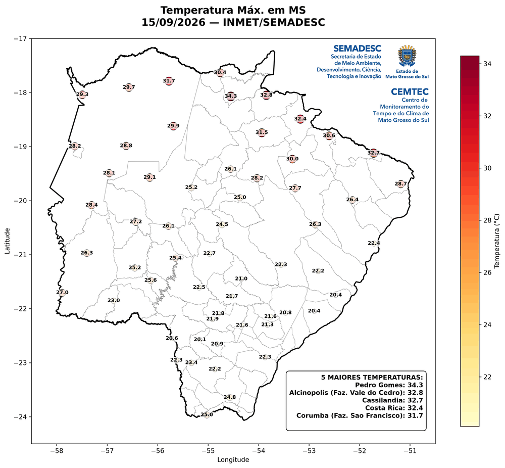 | 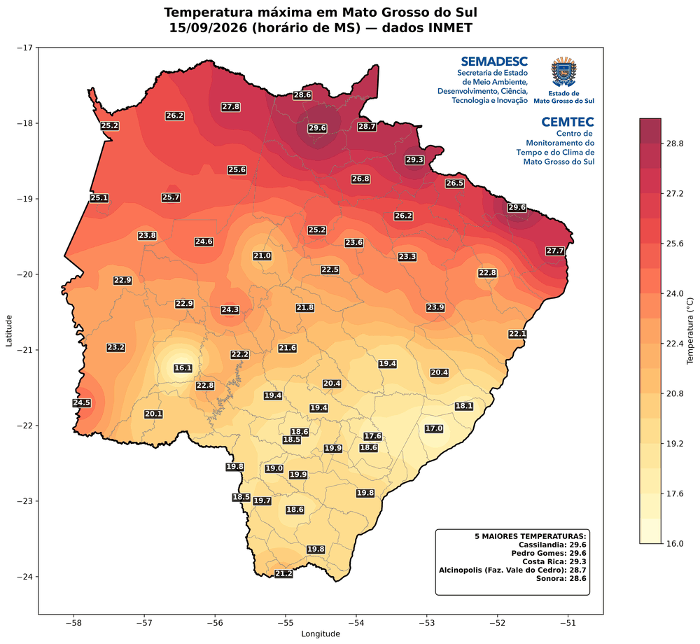 |

| Rajadas com direção (15/09/2026) | Chuva de 48 h — tempo real | Chuva do período (14 e 15/09/2026) |
|---|---|---|
| 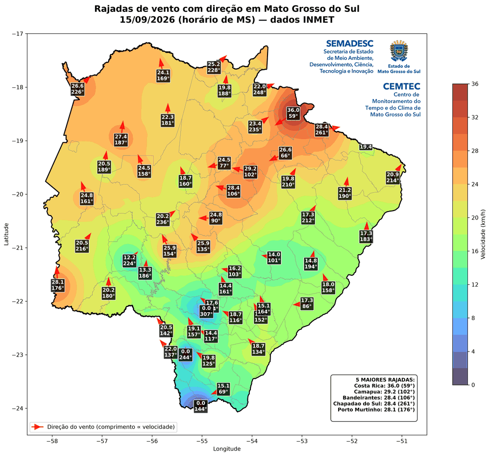 | 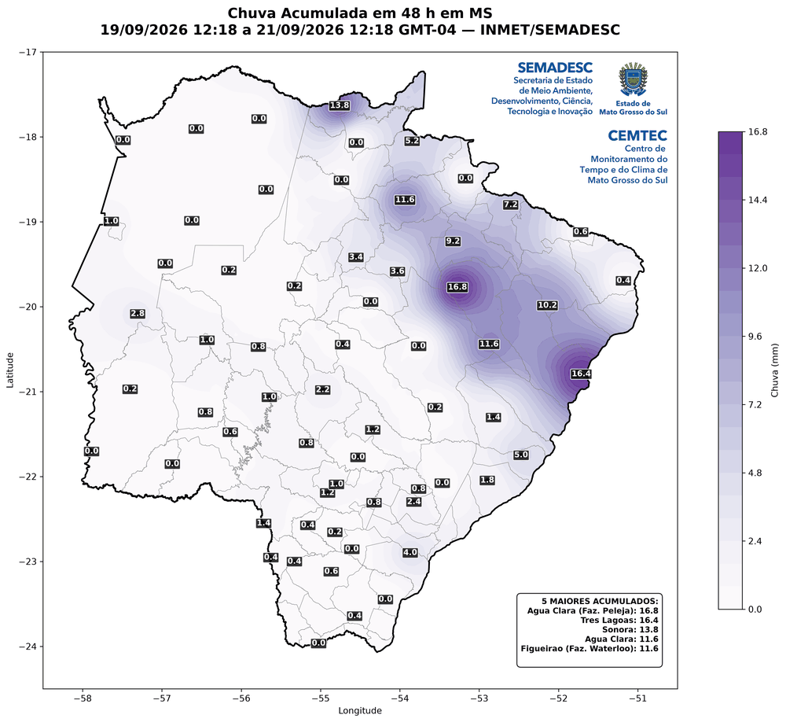 | 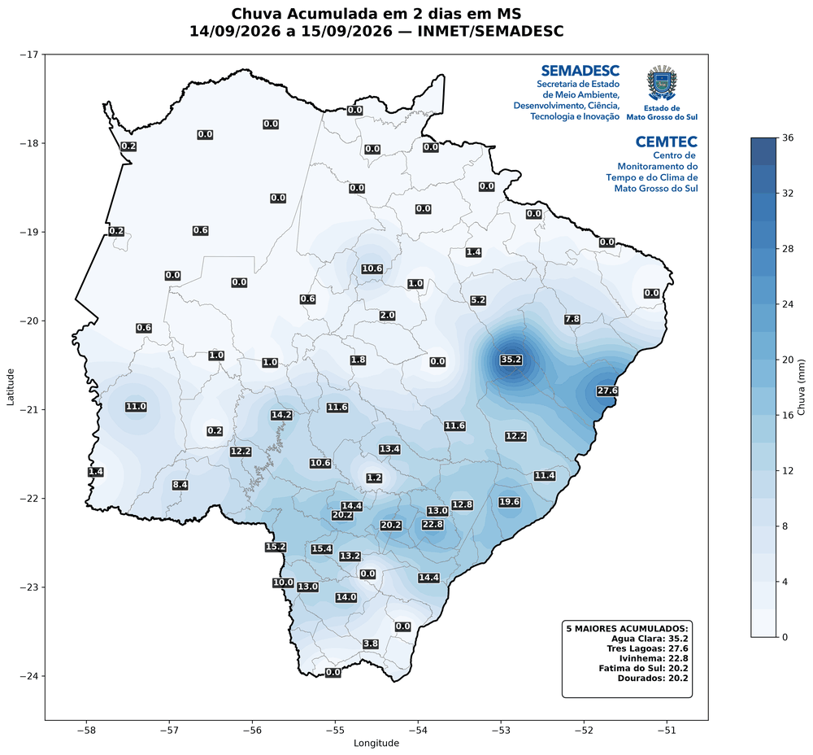 |

#### Dados de referência

- **API do INMET** (`apitempo.inmet.gov.br`)
  - `/estacoes/T` — lista de estações automáticas (sem token)
  - `/token/estacao/{data_ini}/{data_fim}/{codigo}/{token}` — dados horários de uma estação
  - Variáveis usadas: `TEM_MIN`, `TEM_MAX`, `UMD_MIN`, `VEN_RAJ`, `VEN_DIR` e `CHUVA`
- **Shapefiles**: `MS_UF_2022` (limite estadual, malha IBGE 2022) e `MS_mun_simplificado` (limites dos 79 municípios). Detalhes em [Estrutura do repositório](#shapefiles).

#### Notas metodológicas

- **Horários:** a API do INMET retorna os dados em UTC. Os dias, as janelas, os títulos e os nomes das pastas seguem o horário de MS (`America/Campo_Grande`, UTC−4); a planilha traz a data/hora das temperaturas em UTC e em MS.
- **Leituras horárias:** cada leitura do INMET se refere à hora que termina no horário indicado (a das 05 UTC cobre das 04 às 05 UTC). Assim, o dia D — da 00 h às 24 h de MS — reúne as leituras das 05 UTC do dia D às 04 UTC do dia seguinte.
- **Rajada:** `VEN_RAJ` é convertida de m/s para km/h (× 3,6). A direção registrada é a do horário da rajada máxima.
- **Interpolação:** IDW (inverso do quadrado da distância) com os 8 vizinhos mais próximos, em uma grade de 100 × 100 pontos sobre longitude −58,5 a −50,5 e latitude −24,5 a −17,0. A distância é medida em quilômetros, numa projeção equidistante centrada em MS. São necessárias ao menos 3 estações. A superfície é calculada até um pouco além da divisa e recortada exatamente pelo contorno de MS.
- **Mapas de chuva:** incluem as estações com 0 mm, que aparecem no mapa pontual e entram na interpolação. Num dia sem chuva em nenhuma estação, os mapas mostram 0 mm em todo o estado.

#### Mudanças em relação aos scripts legados

Os três scripts de `legado/relatorio_inmet/` foram unificados neste produto. Diferenças nos resultados:

- **Período:** os extremos (temperaturas, umidade e rajada) agora ficam restritos ao período. Antes, o dia seguinte à data final também entrava no cálculo.
- **Data específica:** a aba `Chuva` traz apenas o `Acumulado Dia`. As colunas `Acumulado 24h` e `Acumulado 48h` foram removidas — a de 48 h somava só cerca de 24 h de dados.
- **Temperaturas:** sempre com data e hora completas, em UTC e em horário de MS.
- **Coordenadas:** `Latitude` e `Longitude` em todas as abas; a associação é feita pela própria estação, não pelo nome.
- **Mapa de rajadas com direção:** gerado em todos os modos (antes, só no tempo real).
- **Mapa de chuva de 72 h no tempo real:** novo (antes, só 24 h e 48 h).
- **Dia no horário de MS:** data específica e período usam o dia da 00 h às 24 h de MS (antes, o dia em UTC, com as leituras das 00 às 23 UTC).
- **Temperatura mínima no tempo real:** usa as últimas 24 horas, como as demais variáveis (antes, desde as 00 UTC do dia).
- **"Chuva Hoje" no tempo real:** conta desde a 00 h de MS (antes, desde as 00 UTC).
- **Estações com 0 mm nos mapas de chuva:** aparecem no mapa pontual e entram na interpolação (antes, eram descartadas).
- **Interpolação em quilômetros:** antes, a distância era medida em graus.
- **Horários nos títulos e nos nomes das pastas:** no horário de MS (antes, em UTC).
- **Logos:** em PNG com fundo transparente e posicionados em relação à moldura do mapa — mesmo lugar e proporção nos mapas pontuais e interpolados (antes, nos pontuais, um logo cobria o outro).
- **Bordas dos mapas interpolados:** a cor preenche o estado até a divisa. Antes, a superfície era cortada pela grade de cálculo (células de ~8 km) e deixava falhas em degrau junto às bordas.
- **Desempenho:** shapefiles, logos e máscara do estado são carregados uma única vez por execução, e os limites municipais usam uma versão simplificada (~5% dos vértices, sem diferença visível).

#### Decisões da equipe de meteorologia

Definidas pela equipe em **15/09/2026** (questões 1 a 5 de [`docs/questoes_meteorologia.md`](docs/questoes_meteorologia.md), com as perguntas, as opções e as respostas):

- O dia segue o horário de MS, da 00 h às 24 h.
- No tempo real, a temperatura mínima usa as últimas 24 horas, como as demais variáveis; a "Chuva Hoje" conta desde a 00 h de MS.
- As estações com 0 mm entram nos mapas de chuva, pontual e interpolado.
- As distâncias da interpolação são medidas em quilômetros; potência 2, 8 vizinhos e grade de ~8 km foram mantidos.
- Os extremos restritos ao período e o mapa de rajadas com direção em todos os modos foram confirmados; o acumulado de 48 h da data específica fica de fora por enquanto.
- Os scripts originais continuam em `legado/` até a equipe decidir pela exclusão.

---

### Produto `risco_fogo`

Risco meteorológico de fogo pela regra **30-30-30**. É um produto novo, pedido pela equipe de meteorologia, e não veio de script legado.

#### O que calcula

Conta, **em cada hora**, quantas das três condições da regra são atendidas:

| Condição | Limiar |
|---|---|
| Temperatura máxima | ≥ 30 °C |
| Umidade relativa mínima | ≤ 30 % |
| Rajada de vento | ≥ 30 km/h |

Cada condição atendida soma um nível:

| Nível | Condições atendidas | Classe | Cor |
|:---:|---|---|---|
| 0 | Nenhuma | Sem condição | Cinza |
| 1 | Uma | Risco baixo | Amarelo |
| 2 | Duas | Risco médio | Laranja |
| 3 | As três | Risco alto | Vermelho |

**Por que hora a hora?** Os extremos de um dia acontecem em horários diferentes. Uma estação pode ter 32 °C às 15 h, 28 % de umidade às 18 h e rajada de 35 km/h às 03 h — contando os extremos do dia, seria "risco alto", mas calor, seca e vento nunca estiveram juntos. Avaliando cada hora, só é risco alto se as três condições acontecerem na mesma hora.

Passo a passo de uma execução:

1. Consulta as estações automáticas de MS e baixa a série horária da janela.
2. Em cada estação e em cada hora, conta quantas condições foram atendidas.
3. Gera a planilha com o resumo de cada estação: nível máximo, quantas horas em cada nível e os valores que dispararam as condições.
4. Em cada hora, interpola **separadamente** as três variáveis sobre o estado e aplica a regra em cada ponto do mapa.
5. Gera os mapas de síntese (nível máximo e horas em risco alto) e um mapa por hora.

#### Como rodar

```bash
python main.py --produto risco_fogo --tempo-real                          # últimas 24 horas
python main.py --produto risco_fogo --inicio 03/09/2026                   # um dia
python main.py --produto risco_fogo --inicio 03/09/2026 --hrini 12 --hrfim 18  # trecho de um dia
python main.py --produto risco_fogo --inicio 03/09/2026 --hrtodas         # um dia, com o mapa de todas as horas
```

#### Tempo real e data específica

| | Tempo real | Data específica |
|---|---|---|
| **Janela** | As últimas 24 horas cheias até o momento em que roda | O dia, da 00 h às 24 h de MS — ou o trecho entre `--hrini` e `--hrfim` |
| **Exemplo** | Rodando às 16h10 de 16/09: das 16 h de 15/09 às 16 h de 16/09 | `--inicio 03/09/2026`: da 00 h às 24 h de 03/09 |
| **Pasta** | `tempo_real/20260916_1610/` | `dia/20260903/` |

**Período não é aceito.** Uma consulta com datas diferentes — inclusive com horas que atravessam dois dias, como das 08 h de 14/09 às 08 h de 15/09 — é recusada com uma mensagem. Para período, a equipe prevê gráficos quantitativos (estação × condições atendidas) numa etapa futura, e não mapas.

#### Saídas

```
saida/risco_fogo/dia/20260903/
├── Risco_Fogo_MS_20260903.xlsx
└── mapas/
    ├── Mapa_Risco_Fogo_Nivel_MS_20260903.png
    ├── Mapa_Risco_Fogo_Nivel_MS_20260903_interpolado.png
    ├── Mapa_Risco_Fogo_Horas_MS_20260903.png
    ├── Mapa_Risco_Fogo_Horas_MS_20260903_interpolado.png
    └── horas/
        ├── Mapa_Risco_Fogo_MS_20260903_09h.png
        ├── Mapa_Risco_Fogo_MS_20260903_10h.png
        └── ...
```

| Arquivo | O que é |
|---|---|
| `Risco_Fogo_MS_<datas>.xlsx` | Planilha (aba `Risco`) com uma linha por estação, da de maior risco para a de menor |
| `Mapa_Risco_Fogo_Nivel_MS_<datas>.png` | **Nível máximo — pontual:** o pior nível que cada estação alcançou em alguma hora da janela |
| `Mapa_Risco_Fogo_Nivel_MS_<datas>_interpolado.png` | **Nível máximo — interpolado:** o mesmo, sobre o estado inteiro |
| `Mapa_Risco_Fogo_Horas_MS_<datas>.png` | **Horas em risco alto — pontual:** quantas horas cada estação passou no nível 3 |
| `Mapa_Risco_Fogo_Horas_MS_<datas>_interpolado.png` | **Horas em risco alto — interpolado:** o mesmo, sobre o estado inteiro |
| `horas/Mapa_Risco_Fogo_MS_<data>_<hora>h.png` | **Mapa horário** (só interpolado): o nível de risco naquela hora, com o nível de cada estação e os pontos das condições que ela atendeu |

O **nível máximo** mostra o pico; as **horas em risco alto** mostram a duração — ficar 6 horas em 30-30-30 é bem diferente de ficar 1 hora. Em dias em que nenhuma estação chega ao nível 3, os mapas de horas ficam zerados.

**Quais horas ganham mapa próprio:** por padrão, só as horas em que **pelo menos uma estação** chegou ao risco médio ou alto (nível ≥ 2); num dia ameno, a pasta `horas/` nem é criada. Com `--hrtodas`, saem todas as horas, até 24 num dia. Cada mapa horário leva a hora em que a leitura termina: o das 14h mostra a hora das 13 h às 14 h.

**Pontos das condições nos mapas horários:** o número de cada estação é o nível dela **naquela hora**, e abaixo dele aparece um ponto para cada condição atendida — roxo para temperatura, azul para umidade e verde para rajada. Cada condição ocupa sempre a mesma posição (temperatura à esquerda, umidade no meio, rajada à direita), então dá para identificá-la mesmo sem distinguir as cores. Os mapas de síntese não têm os pontos: eles juntam horas diferentes, e as condições de uma única hora não representariam o dia.

Colunas da planilha:

| Coluna | O que é |
|---|---|
| `Nível Máximo` | Pior nível alcançado na janela (0 a 3) |
| `Horas em Risco Alto`, `Horas Nível 2`, `Horas Nível 1` | Quantas horas a estação passou em cada nível |
| `Horas com Dados` | Quantas horas tinham as três variáveis |
| `Temp. Máxima (°C)`, `Umidade Mínima (%)`, `Rajada Máxima (km/h)` | Extremos da janela, para conferir por que a estação recebeu o seu nível |
| `Primeiro Horário em Risco Alto (MS)` | Quando a estação chegou ao nível 3 pela primeira vez (vazio se não chegou) |
| `Latitude`, `Longitude` | Posição da estação |

#### Exemplos

Mapas gerados com dados reais do INMET para **03/09/2026**.

| Nível máximo — pontual | Nível máximo — interpolado | Horas em risco alto — interpolado |
|---|---|---|
| 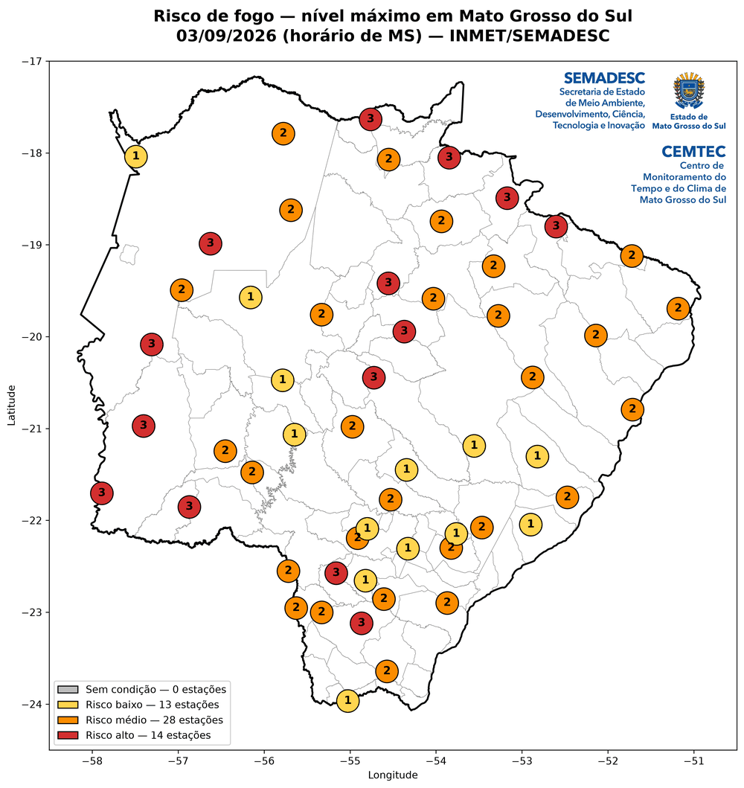 | 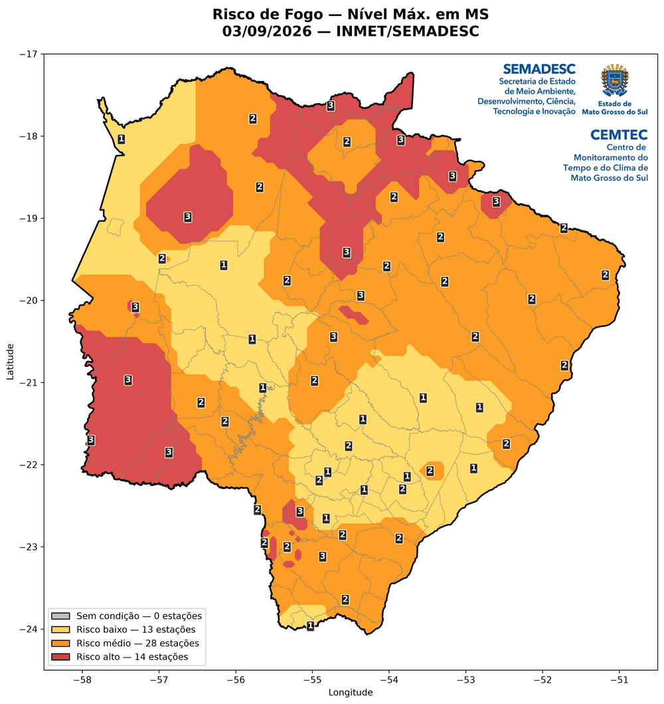 | 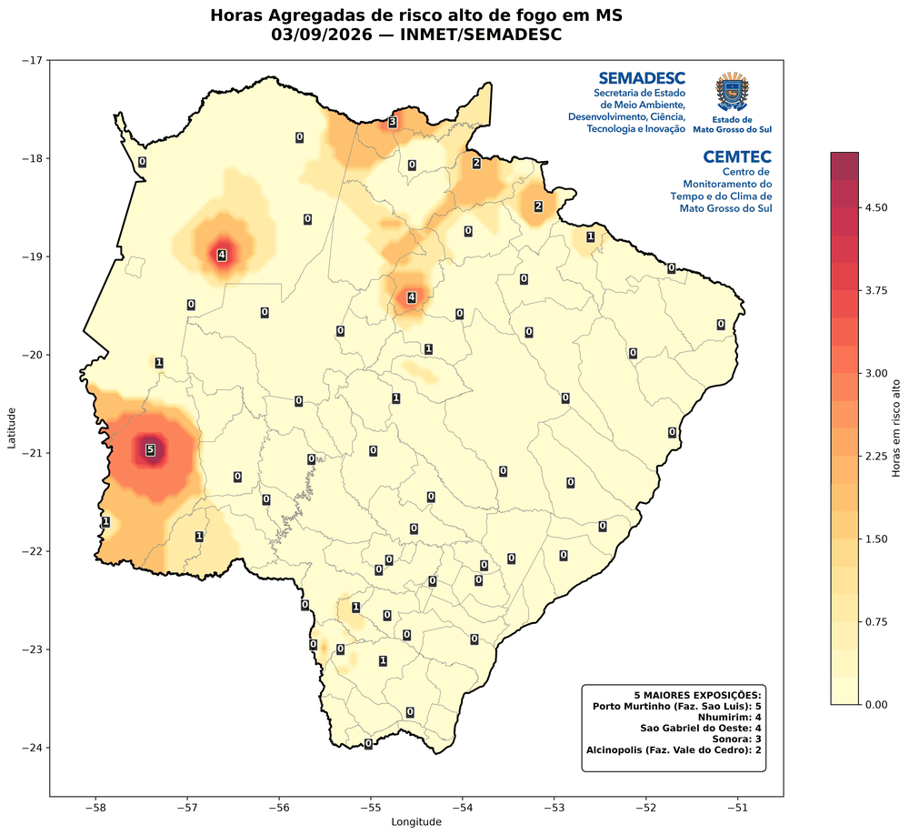 |

A evolução ao longo do dia, nos mapas horários — o risco sobe pela manhã, atinge o pico no início da tarde e recua no fim do dia:

| 11h | 14h | 18h |
|---|---|---|
| 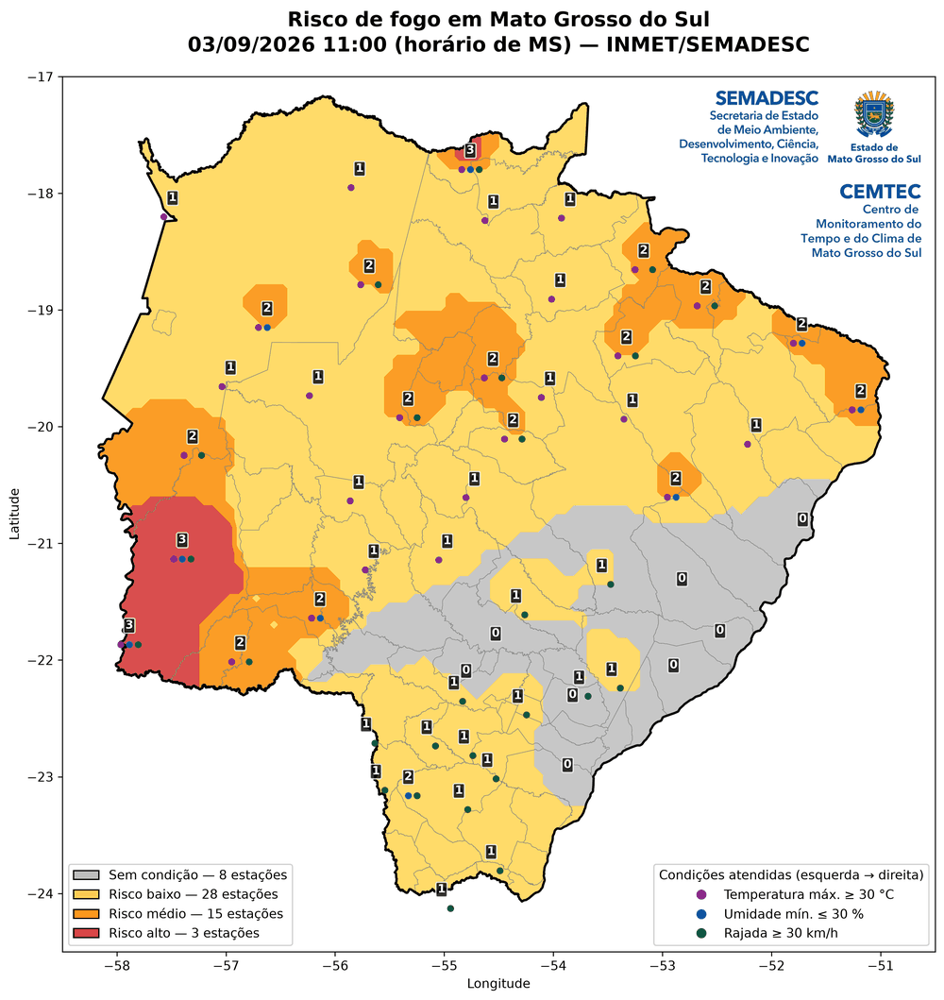 | 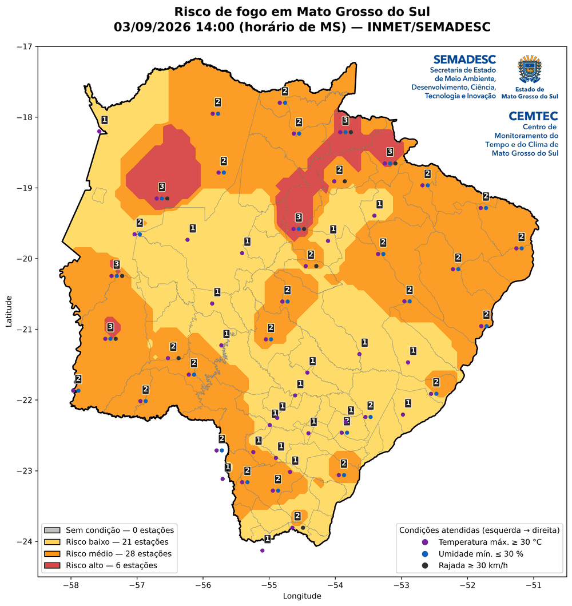 | 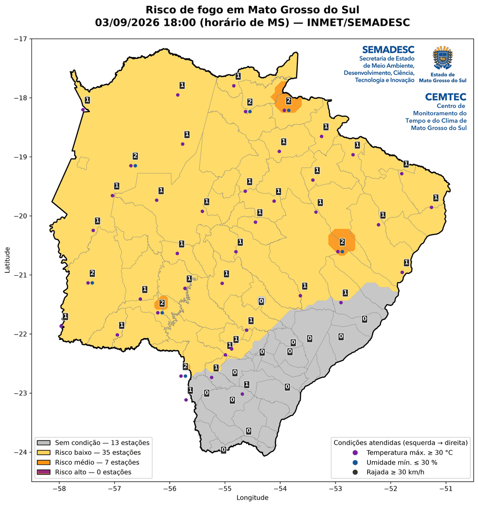 |

#### Dados de referência

- **API do INMET** (`apitempo.inmet.gov.br`)
  - `/estacoes/T` — lista de estações automáticas (sem token)
  - `/token/estacao/{data_ini}/{data_fim}/{codigo}/{token}` — dados horários de uma estação
  - Variáveis usadas: `TEM_MAX`, `UMD_MIN` e `VEN_RAJ`
- **Limiares, cores e rótulos** ficam em [`modulos/config.py`](modulos/config.py): `LIMIAR_TEMP_MAX`, `LIMIAR_UMIDADE_MIN`, `LIMIAR_RAJADA`, `CORES_RISCO`, `ROTULOS_RISCO`, `NIVEL_MAPA_HORARIO` e `CORES_CONDICOES` (cores dos pontos das condições).
- **Shapefiles**: `MS_UF_2022` (limite estadual, malha IBGE 2022) e `MS_mun_simplificado` (limites dos 79 municípios). Detalhes em [Estrutura do repositório](#shapefiles).

#### Notas metodológicas

- **Horários e leituras:** como no `relatorio_inmet`, os dados chegam em UTC e são exibidos no horário de MS, e cada leitura se refere à hora que termina no horário indicado.
- **Limiares inclusivos:** exatamente 30 °C, 30 % ou 30 km/h já contam como condição atendida.
- **Rajada:** `VEN_RAJ` vem em m/s e é convertida para km/h (× 3,6) antes da comparação — 30 km/h equivalem a 8,33 m/s.
- **Simultaneidade:** a regra é testada dentro de cada leitura horária, que traz a temperatura máxima, a umidade mínima e a rajada daquela hora. Dentro de uma mesma hora, os três valores podem estar separados por alguns minutos: é a resolução mais fina que a API oferece.
- **Interpolação:** mesmo IDW do `relatorio_inmet` (8 vizinhos, distância em km, grade de 100 × 100), aplicado **a cada hora e a cada variável separadamente**; a regra 30-30-30 é aplicada depois, ponto a ponto. Interpolar o nível 0–3 diretamente produziria valores sem sentido físico ("1,7 condições") e espalharia risco médio onde nenhuma estação o registrou. Horas com menos de 3 estações não são interpoladas.
- **Mapas de síntese interpolados:** saem da pilha de mapas horários — o nível máximo é o maior nível de cada ponto ao longo das horas, e as horas em risco alto são quantas vezes cada ponto chegou ao nível 3.
- **Pontual e interpolado podem discordar**, e isso não é erro: a superfície pode mostrar nível 2 num lugar onde nenhuma estação chegou a 2, porque ela vem das variáveis interpoladas, e não dos níveis das estações.
- **Rajada é a variável menos confiável do mapa interpolado:** vento de rajada é muito local, então a superfície de vento é mais incerta que as de temperatura e umidade.
- **Estações incompletas:** estações a que falte temperatura, umidade ou rajada ficam de fora e são listadas ao rodar — incluí-las subestimaria o risco, já que nunca poderiam alcançar o nível 3.

#### Mudanças em relação aos scripts legados

Não se aplica: o `risco_fogo` é um produto novo, desenvolvido a partir do pedido da equipe de meteorologia, sem script legado de origem.

#### Decisões da equipe de meteorologia

O método foi definido em **16/09/2026** a partir do pedido da equipe (questões 6 a 8 de [`docs/questoes_meteorologia.md`](docs/questoes_meteorologia.md)):

- Regra avaliada hora a hora, e não sobre os extremos do período.
- Três variáveis interpoladas separadamente, com a regra aplicada ponto a ponto.
- Somente data específica e tempo real; período fica para os gráficos de uma etapa futura.
- Mapas de síntese (nível máximo e horas em risco alto) em versão pontual e interpolada; mapas horários só interpolados, filtrados pelo nível ≥ 2 nas estações, ou todos com `--hrtodas`.
- As três condições têm o mesmo peso; estações sem uma das variáveis ficam de fora.
- Cores cinza, amarelo, laranja e vermelho (sem o par verde/vermelho, por causa do daltonismo).
- Nos mapas horários, pontos das condições atendidas abaixo de cada estação, em posição fixa (definido em 17/09/2026).

⚠️ **Ainda aguardam confirmação da meteorologia:** a aproximação de simultaneidade dentro da hora, a confiabilidade da rajada interpolada, os limiares (≥ 30 °C, ≤ 30 %, ≥ 30 km/h) e o critério do nível laranja para gerar mapa horário.

---

## Requisitos

- Python **3.10 ou superior**
- Token de acesso à API do INMET
- Conexão com a internet

Principais bibliotecas (lista completa em [`requirements.txt`](requirements.txt)):

| Biblioteca | Uso |
|---|---|
| `pandas` | Tabelas, datas e exportação para Excel |
| `requests` | Chamadas à API do INMET |
| `numpy` / `scipy` | Grade e interpolação IDW (`cKDTree`) |
| `geopandas` / `shapely` | Leitura dos shapefiles e recorte espacial |
| `matplotlib` | Geração dos mapas |
| `openpyxl` | Escrita e formatação da planilha Excel |
| `tzdata` | Fusos horários (obrigatório no Windows) |
| `python-dotenv` | Leitura do arquivo `.env` |

## Instalação

**Windows (PowerShell):**

```powershell
python -m venv .venv
.venv\Scripts\Activate.ps1
pip install -r requirements.txt
```

**Linux / macOS:**

```bash
python3 -m venv .venv
source .venv/bin/activate
pip install -r requirements.txt
```

## Configuração

### Token do INMET

O token é lido do arquivo `.env`, na raiz do projeto:

1. Crie o `.env` a partir do modelo:

   ```powershell
   Copy-Item .env.example .env
   ```

   No Linux/macOS: `cp .env.example .env`.

2. Abra o `.env` e preencha `TOKEN_INMET` com o token da equipe:

   ```
   TOKEN_INMET=seu_token_aqui
   ```

Sem o token configurado, o `main.py` para com uma mensagem de erro antes de chamar a API.

> O `.env` contém credenciais e **nunca deve ser commitado** — ele já está no `.gitignore`. Em agendamentos ou servidores, o token também pode ser definido como variável de ambiente `TOKEN_INMET`, que tem prioridade sobre o `.env`.

### Logos

Os logos ficam em `img/`, em **PNG com fundo transparente** — uma imagem com fundo branco cobriria o mapa. A posição e o tamanho de cada um são definidos na lista `LOGOS`, em [`modulos/config.py`](modulos/config.py), como um retângulo `[x, y, largura, altura]` em fração da moldura do mapa: `(0, 0)` é o canto inferior esquerdo e `(1, 1)` o superior direito. O logo se ajusta ao retângulo mantendo a proporção e fica alinhado ao canto superior direito dele, no mesmo lugar em todos os mapas.

### Demais parâmetros

Ficam em [`modulos/config.py`](modulos/config.py): UF, pastas, endereços, tempos limite e tentativas da API, limites e resolução dos mapas, posição dos logos, parâmetros da interpolação e limiares do risco de fogo.

### Quando a API do INMET falha

É comum a API encerrar a conexão sem responder no meio de uma consulta. Nesse caso, a estação é consultada de novo até `TENTATIVAS` vezes (padrão: 3), dobrando a espera a cada tentativa. Se ainda assim não der certo, a execução continua com as demais estações e o resumo do fim separa as que ficaram de fora:

- **Sem leituras no período** — a estação respondeu, mas não tem dados nessas horas.
- **Falha na consulta** — não foi possível ler a estação. Ela pode ter dados: vale repetir a consulta mais tarde.

Erros de token (HTTP 4xx) não são repetidos, porque novas tentativas não resolvem.

## Testes

Os testes usam uma API do INMET simulada, então não precisam de token nem de internet:

```bash
pip install -r requirements-dev.txt
pytest
```

Rode os testes antes de cada commit: eles conferem as janelas de tempo, os cálculos, o acesso à API e a execução completa (Excel e mapas) de cada produto.

Os testes também rodam automaticamente no GitHub (GitHub Actions, em Linux, com Python 3.10 e 3.14) a cada push e a cada pull request para a `main`. O resultado aparece como ✓ ou ✗ ao lado de cada commit e na aba **Actions** do repositório, onde também é possível rodá-los manualmente.

## Novos produtos

Os scripts da equipe estão sendo migrados aos poucos. Cada um vira um produto em `modulos/produtos/`, reaproveitando as peças compartilhadas (API do INMET, períodos, cálculos, mapas e Excel). O passo a passo está em [`docs/como_migrar_um_script.md`](docs/como_migrar_um_script.md).

Cada produto ganha a sua seção em [Como usar](#como-usar), sempre com as mesmas subseções, nesta ordem: **O que calcula**, **Como rodar**, **modos de tempo aceitos**, **Saídas**, **Exemplos**, **Dados de referência**, **Notas metodológicas**, **Mudanças em relação aos scripts legados** e **Decisões da equipe de meteorologia**. As imagens dos exemplos ficam em `docs/img/<produto>/`, reduzidas para cerca de 1000 px de largura.

## Estrutura do repositório

```
.
├── main.py               # Ponto de entrada: escolha do produto e das datas
├── modulos/              # Peças compartilhadas por todos os produtos
│   ├── config.py         # Configurações, leitura do .env e a classe Periodo (janelas de tempo)
│   ├── inmet.py          # Acesso à API do INMET (estações e dados horários)
│   ├── calculos.py       # Recorte no tempo, extremos, acumulados e interpolação IDW
│   ├── mapas.py          # Mapas pontuais, interpolados e de classes (níveis de risco)
│   ├── excel.py          # Planilha Excel
│   └── produtos/         # Um arquivo por produto
│       ├── relatorio_inmet.py  # Extremos e chuva das estações automáticas
│       └── risco_fogo.py       # Risco de fogo pela regra 30-30-30, hora a hora
├── ferramentas/          # Scripts auxiliares (ex.: gerar o shapefile simplificado dos municípios)
├── tests/                # Testes automatizados (pytest), com a API do INMET simulada
├── .github/workflows/    # Execução automática dos testes no GitHub (GitHub Actions)
├── docs/                 # Documentos da equipe (ex.: questões para a meteorologia, guia de migração)
│   └── img/              # Mapas de exemplo usados neste README, um subdiretório por produto
├── shp/                  # Shapefiles: limite estadual e municípios (original e simplificado)
├── img/                  # Logos inseridos nos mapas (PNG com fundo transparente)
├── saida/                # Resultados gerados (fora do controle de versão)
├── legado/               # Scripts originais de cada produto (ex.: legado/relatorio_inmet/), para comparação
├── requirements.txt
├── requirements-dev.txt  # Dependências de desenvolvimento (testes)
├── pytest.ini            # Configuração dos testes
├── .env                  # Token do INMET (local, fora do controle de versão)
├── .env.example          # Modelo do arquivo .env
└── README.md
```

### Shapefiles

Todos os mapas usam os shapefiles de `shp/` (SIRGAS 2000, EPSG:4674, reprojetados para WGS 84/EPSG:4326 na execução):

- `MS_UF_2022` — limite estadual (malha IBGE 2022).
- `MS_mun` — limites dos 79 municípios, versão original e detalhada (~755 mil vértices).
- `MS_mun_simplificado` — versão usada nos mapas, simplificada com tolerância de 0,001° (~100 m, menos de meio pixel): ~5% dos vértices e sem diferença visível. Serve só para desenho; para cálculos de área ou análises espaciais, use o original. Se a malha municipal for atualizada, substitua os arquivos `MS_mun.*` e gere a versão simplificada de novo com `python ferramentas/simplificar_municipios.py`.

> Cada shapefile é formado por vários arquivos com o mesmo nome (`.shp`, `.shx`, `.dbf`, `.prj`, `.cpg`), que precisam ficar juntos na mesma pasta.
