# Scripts UNIGEO / CEMTEC — Monitoramento meteorológico de Mato Grosso do Sul

Produtos meteorológicos gerados a partir dos dados horários das **estações automáticas do INMET** em Mato Grosso do Sul, com **planilhas Excel** e **mapas** (pontuais e interpolados).

| Produto | O que gera |
|---|---|
| [`relatorio_inmet`](#produto-relatorio_inmet) | Extremos de temperatura, umidade e rajada e chuva acumulada de cada estação: planilha Excel e mapas |
| [`risco_fogo`](#produto-risco_fogo) | Risco meteorológico de fogo pela regra 30-30-30, avaliada hora a hora: planilha Excel e mapas de nível de risco |

Desenvolvido pela equipe de meteorologia do **CEMTEC** — Centro de Monitoramento do Tempo e do Clima de Mato Grosso do Sul (SEMADESC).

---

## Sumário

- [Como usar](#como-usar)
  - [Primeiros passos](#primeiros-passos)
  - [Como rodar um produto](#como-rodar-um-produto)
  - [Produto `relatorio_inmet`](#produto-relatorio_inmet)
  - [Produto `risco_fogo`](#produto-risco_fogo)
- [Requisitos](#requisitos)
- [Instalação](#instalação)
- [Como atualizar](#como-atualizar)
- [Configuração](#configuração)
- [Testes](#testes)
- [Explorador (Streamlit)](#explorador-streamlit)
- [Novos produtos](#novos-produtos)
- [Estrutura do repositório](#estrutura-do-repositório)

---

## Como usar

### Primeiros passos

1. Instale o Python e as dependências (veja [Instalação](#instalação)).
2. Configure o token do INMET no arquivo `.env` (veja [Configuração](#configuração)).
3. Escolha o produto e o período, e rode o `main.py` como explicado abaixo.

### Como rodar um produto

Todos os produtos são gerados pelo mesmo arquivo, o [`main.py`](main.py). Há duas formas de dizer **qual produto** gerar e **de quando** são os dados.

**1. Pela linha de comando** (sem editar nada):

```bash
python main.py --produto relatorio_inmet --dataini 15/09/2026
```

| Opção | O que faz | Exemplo |
|---|---|---|
| `--produto` | Escolhe o produto | `--produto risco_fogo` |
| `--dataini` | Data inicial (DD/MM/AAAA) | `--dataini 15/09/2026` |
| `--datafim` | Data final; se omitida, igual à inicial | `--datafim 20/09/2026` |
| `--hrini` | Hora de início, no horário de MS (0 a 24) | `--hrini 8` |
| `--hrfim` | Hora de fim, no horário de MS (0 a 24) | `--hrfim 18` |
| `--tempo-real` | Últimas 24 horas até o momento em que roda | `--tempo-real` |
| `--hrtodas` | Só para o `risco_fogo`: gera o mapa de todas as horas | `--hrtodas` |

As horas aceitam `8`, `08h` ou `08:00`. Para ver todas as opções: `python main.py --help`.

**2. Editando o topo do `main.py`** e rodando só `python main.py`:

```python
PRODUTO = "relatorio_inmet"
DATA_INICIAL = date(2026, 8, 1)
DATA_FINAL = date(2026, 8, 31)
HORA_INICIAL = None  # opcional: hora de início (0 a 24); None = 00 h
HORA_FINAL = None    # opcional: hora de fim (0 a 24); None = 24 h
```

O que a linha de comando não informar é lido dessas variáveis.

#### Os três modos de tempo

O modo é definido pelas datas:

| Modo | Como pedir | Janela de tempo (horário de MS) |
|---|---|---|
| **Data específica** | `--dataini 15/09/2026` (ou `DATA_INICIAL` igual a `DATA_FINAL`) | O dia, da 00 h às 24 h |
| **Estado** | `--uf MS` | Só as UFs com shapefile em `shp/` (padrão: MS). Troca junto o fuso, as estações e o enquadramento dos mapas |
| **Período** | `--dataini 01/08/2026 --datafim 31/08/2026` (ou datas diferentes) | Da 00 h da data inicial às 24 h da data final |
| **Tempo real** | `--tempo-real` (ou as duas datas `None`) | As últimas 24 horas, até o momento em que roda |

Com `--hrini` e `--hrfim`, a janela passa a começar e terminar nessas horas — por exemplo, `--dataini 14/09/2026 --hrini 8 --datafim 15/09/2026 --hrfim 8` cobre das 08 h de 14/09 às 08 h de 15/09. O modo continua definido pelas datas (mesmo dia = data específica; datas diferentes = período). As horas não valem com `--tempo-real`.

**`--produto` e o modo de tempo são independentes.** O `--produto` diz *o que* gerar; `--dataini`/`--datafim` ou `--tempo-real` dizem *de quando* são os dados. Qualquer produto pode ser combinado com qualquer modo que ele aceite:

| Produto | Data específica | Período | Tempo real |
|---|:---:|:---:|:---:|
| `relatorio_inmet` | ✅ | ✅ | ✅ |
| `risco_fogo` | ✅ | ✅ | ✅ |

#### Onde ficam os resultados

Cada execução cria uma pasta própria dentro de `saida/`, separada por produto e por modo: `saida/<produto>/<modo>/<datas>/`. O nome da última pasta indica a janela consultada, no horário de MS:

| Consulta | Pasta |
|---|---|
| Data específica | `dia/20260915/` |
| Período | `periodo/20260801_a_20260831/` |
| Com horas | `periodo/20260914_08h_a_20260915_08h/` |
| Tempo real (rodado às 16h10 de 16/09) | `tempo_real/20260916_1610/` |

O conteúdo de `saida/` fica fora do controle de versão. O que cada produto grava nessa pasta está na seção **Saídas** de cada um, abaixo.

---

### Produto `relatorio_inmet`

Relatório de extremos e chuva das estações automáticas do INMET em MS.

#### O que calcula

Para cada estação automática de MS, na janela consultada:

| Variável | O que é calculado | Aba da planilha |
|---|---|---|
| Temperatura mínima | Menor valor, com data e hora | `Temp_Min` |
| Temperatura máxima | Maior valor, com data e hora | `Temp_Max` |
| Umidade relativa mínima | Menor valor | `Umidade` |
| Rajada de vento | Maior rajada (km/h) e a direção registrada no mesmo horário | `Vento` |
| Chuva | Acumulado na janela (no tempo real, em várias janelas) | `Chuva` |

Passo a passo de uma execução:

1. Consulta a lista de estações automáticas do INMET e filtra as de MS.
2. Baixa a série horária de cada estação pela API do INMET.
3. Calcula os extremos e os acumulados de cada variável.
4. Gera a planilha Excel com uma aba por variável, ordenada pelo valor.
5. Gera os mapas com o limite estadual, os municípios, o ranking dos 5 maiores (ou menores) valores e os logos institucionais.

#### Como rodar

```bash
python main.py --produto relatorio_inmet --dataini 15/09/2026                                   # data específica
python main.py --produto relatorio_inmet --dataini 01/08/2026 --datafim 31/08/2026                  # período
python main.py --produto relatorio_inmet --dataini 14/09/2026 --hrini 8 --datafim 15/09/2026 --hrfim 8  # com horas
python main.py --produto relatorio_inmet --tempo-real                                          # tempo real
```

#### Tempo real, data específica e período

| | Tempo real | Data específica | Período |
|---|---|---|---|
| **Extremos** (temperaturas, umidade e rajada) | Últimas 24 h | O dia (00 h às 24 h de MS) | Da 00 h da data inicial às 24 h da data final |
| **Chuva na planilha** | Hoje (desde a 00 h de MS), 12 h, 24 h, 48 h e 72 h | Total do dia (`Acumulado Dia`) | Total do período (`Acumulado Período`) |
| **Mapas de chuva** | 24 h, 48 h e 72 h | 24 h | Período |
| **Total de mapas** | 15 | 11 | 11 |

Quando a consulta usa horas (`--hrini`/`--hrfim`), a chuva aparece como `Acumulado Período`, com a duração em horas no título do mapa.

#### Saídas

```
saida/relatorio_inmet/dia/20260915/
├── Relatorio_MS_20260915.xlsx
└── mapas/
    ├── Mapa_Temp_Min_MS_20260915.png
    ├── Mapa_Temp_Min_MS_20260915_interpolado.png
    ├── Mapa_Temp_Max_MS_20260915.png
    ├── Mapa_Temp_Max_MS_20260915_interpolado.png
    ├── Mapa_Umidade_MS_20260915.png
    ├── Mapa_Umidade_MS_20260915_interpolado.png
    ├── Mapa_Chuva_24h_MS_20260915.png
    ├── Mapa_Chuva_24h_MS_20260915_interpolado.png
    ├── Mapa_Rajadas_MS_20260915.png
    ├── Mapa_Rajadas_MS_20260915_interpolado.png
    └── Mapa_Rajadas_Direcao_MS_20260915.png
```

| Arquivo | O que é |
|---|---|
| `Relatorio_MS_<datas>.xlsx` | Planilha com as abas `Temp_Min`, `Temp_Max`, `Umidade`, `Vento` e `Chuva`, com latitude e longitude de cada estação |
| `Mapa_<variável>_MS_<datas>.png` | Mapa **pontual**: cada estação colorida e rotulada com o seu valor |
| `Mapa_<variável>_MS_<datas>_interpolado.png` | Mapa **interpolado**: superfície contínua sobre o estado inteiro, com as estações por cima |
| `Mapa_Rajadas_Direcao_MS_<datas>.png` | Rajadas interpoladas com setas mostrando a direção do vento |
| `Mapa_Chuva_24h`, `_48h`, `_72h` ou `_Periodo` | Um mapa de chuva para cada janela do modo (veja a tabela acima) |

#### Exemplos

Mapas gerados com dados reais do INMET. O **pontual** mostra só o que foi medido em cada estação; o **interpolado** estima os valores entre as estações.

| Temperatura máxima — pontual (15/09/2026) | Temperatura máxima — interpolado (15/09/2026) |
|---|---|
| 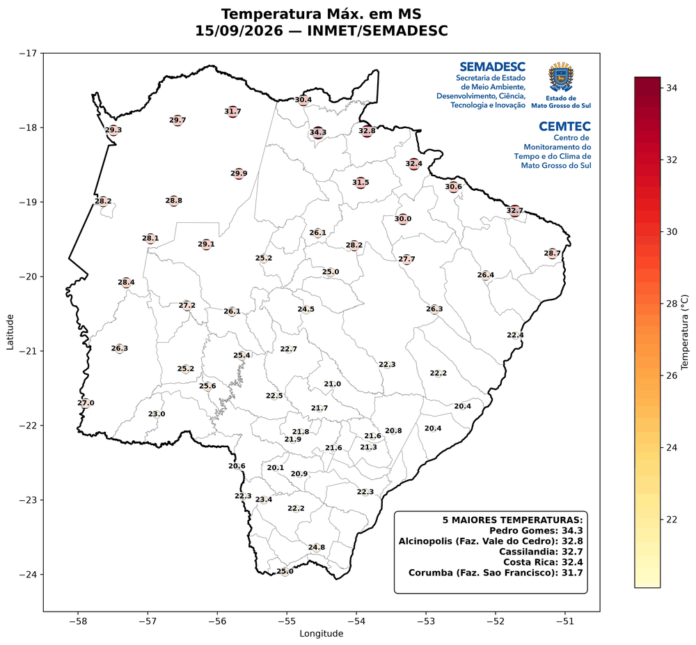 | 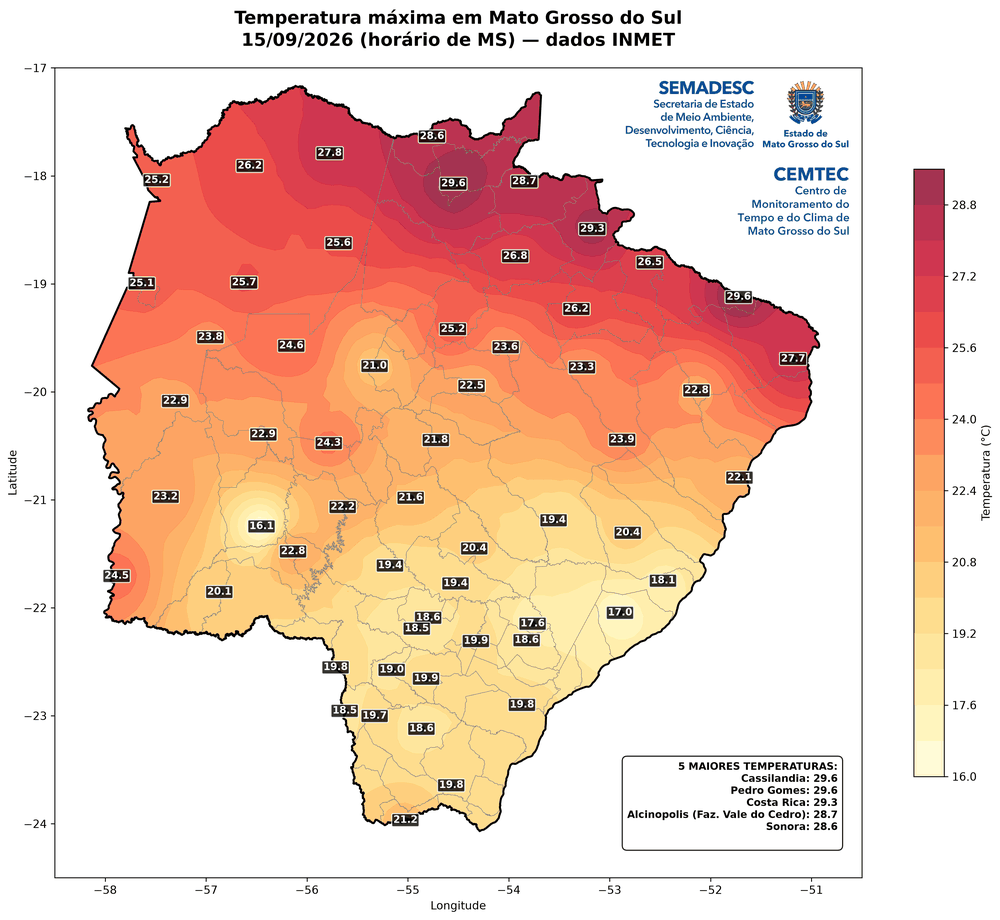 |

| Rajadas com direção (15/09/2026) | Chuva de 48 h — tempo real | Chuva do período (14 e 15/09/2026) |
|---|---|---|
| 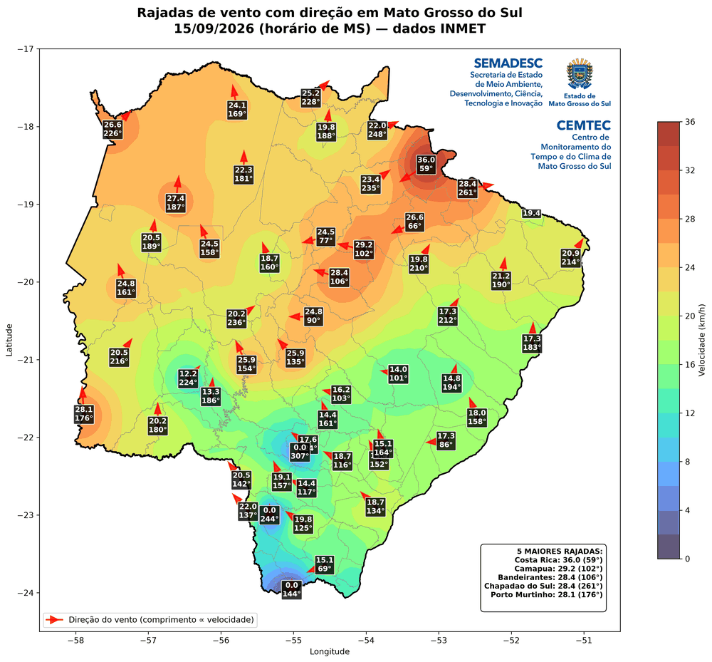 | 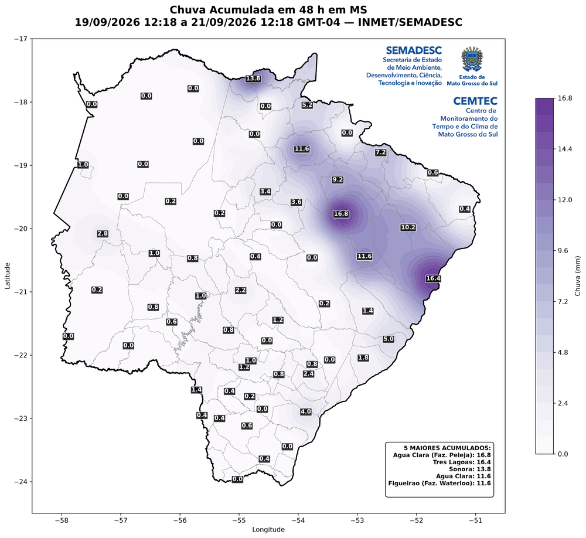 | 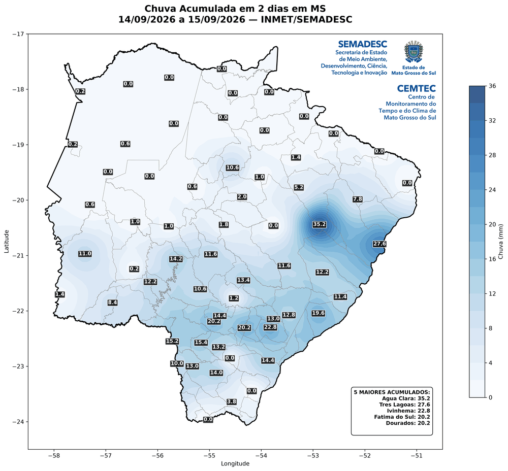 |

#### Dados de referência

- **API do INMET** (`apitempo.inmet.gov.br`)
  - `/estacoes/T` — lista de estações automáticas (sem token)
  - `/token/estacao/{data_ini}/{data_fim}/{codigo}/{token}` — dados horários de uma estação
  - Variáveis usadas: `TEM_MIN`, `TEM_MAX`, `UMD_MIN`, `VEN_RAJ`, `VEN_DIR` e `CHUVA`
- **Shapefiles**: `MS_UF_2022` (limite estadual, malha IBGE 2022) e `MS_mun_simplificado` (limites dos 79 municípios). Detalhes em [Estrutura do repositório](#shapefiles).

#### Notas metodológicas

- **Horários:** a API do INMET retorna os dados em UTC. Os dias, as janelas, os títulos e os nomes das pastas seguem o horário de MS (`America/Campo_Grande`, UTC−4); a planilha traz a data/hora das temperaturas em UTC e em MS.
- **Leituras horárias:** cada leitura do INMET se refere à hora que termina no horário indicado (a das 05 UTC cobre das 04 às 05 UTC). Assim, o dia D — da 00 h às 24 h de MS — reúne as leituras das 05 UTC do dia D às 04 UTC do dia seguinte.
- **Rajada:** `VEN_RAJ` é convertida de m/s para km/h (× 3,6). A direção registrada é a do horário da rajada máxima.
- **Interpolação:** IDW (inverso do quadrado da distância) com os 8 vizinhos mais próximos, em uma grade de 100 × 100 pontos sobre longitude −58,5 a −50,5 e latitude −24,5 a −17,0. A distância é medida em quilômetros, numa projeção equidistante centrada em MS. São necessárias ao menos 3 estações. A superfície é calculada até um pouco além da divisa e recortada exatamente pelo contorno de MS.
- **Mapas de chuva:** incluem as estações com 0 mm, que aparecem no mapa pontual e entram na interpolação. Num dia sem chuva em nenhuma estação, os mapas mostram 0 mm em todo o estado.

#### Mudanças em relação aos scripts legados

Os três scripts de `legado/relatorio_inmet/` foram unificados neste produto. Diferenças nos resultados:

- **Período:** os extremos (temperaturas, umidade e rajada) agora ficam restritos ao período. Antes, o dia seguinte à data final também entrava no cálculo.
- **Data específica:** a aba `Chuva` traz apenas o `Acumulado Dia`. As colunas `Acumulado 24h` e `Acumulado 48h` foram removidas — a de 48 h somava só cerca de 24 h de dados.
- **Temperaturas:** sempre com data e hora completas, em UTC e em horário de MS.
- **Coordenadas:** `Latitude` e `Longitude` em todas as abas; a associação é feita pela própria estação, não pelo nome.
- **Mapa de rajadas com direção:** gerado em todos os modos (antes, só no tempo real).
- **Mapa de chuva de 72 h no tempo real:** novo (antes, só 24 h e 48 h).
- **Dia no horário de MS:** data específica e período usam o dia da 00 h às 24 h de MS (antes, o dia em UTC, com as leituras das 00 às 23 UTC).
- **Temperatura mínima no tempo real:** usa as últimas 24 horas, como as demais variáveis (antes, desde as 00 UTC do dia).
- **"Chuva Hoje" no tempo real:** conta desde a 00 h de MS (antes, desde as 00 UTC).
- **Estações com 0 mm nos mapas de chuva:** aparecem no mapa pontual e entram na interpolação (antes, eram descartadas).
- **Interpolação em quilômetros:** antes, a distância era medida em graus.
- **Horários nos títulos e nos nomes das pastas:** no horário de MS (antes, em UTC).
- **Logos:** em PNG com fundo transparente e posicionados em relação à moldura do mapa — mesmo lugar e proporção nos mapas pontuais e interpolados (antes, nos pontuais, um logo cobria o outro).
- **Bordas dos mapas interpolados:** a cor preenche o estado até a divisa. Antes, a superfície era cortada pela grade de cálculo (células de ~8 km) e deixava falhas em degrau junto às bordas.
- **Desempenho:** shapefiles, logos e máscara do estado são carregados uma única vez por execução, e os limites municipais usam uma versão simplificada (~5% dos vértices, sem diferença visível).

#### Decisões da equipe de meteorologia

Definidas pela equipe em **15/09/2026** (questões 1 a 5 de [`docs/questoes_meteorologia.md`](docs/questoes_meteorologia.md), com as perguntas, as opções e as respostas):

- O dia segue o horário de MS, da 00 h às 24 h.
- No tempo real, a temperatura mínima usa as últimas 24 horas, como as demais variáveis; a "Chuva Hoje" conta desde a 00 h de MS.
- As estações com 0 mm entram nos mapas de chuva, pontual e interpolado.
- As distâncias da interpolação são medidas em quilômetros; potência 2, 8 vizinhos e grade de ~8 km foram mantidos.
- Os extremos restritos ao período e o mapa de rajadas com direção em todos os modos foram confirmados; o acumulado de 48 h da data específica fica de fora por enquanto.
- Os scripts originais continuam em `legado/` até a equipe decidir pela exclusão.

---

### Produto `risco_fogo`

Risco meteorológico de fogo pela regra **30-30-30**. É um produto novo, pedido pela equipe de meteorologia, e não veio de script legado.

#### O que calcula

Conta, **em cada hora**, quantas das três condições da regra são atendidas:

| Condição | Limiar |
|---|---|
| Temperatura máxima | ≥ 30 °C |
| Umidade relativa mínima | ≤ 30 % |
| Rajada de vento | ≥ 30 km/h |

Cada condição atendida soma um nível:

| Nível | Condições atendidas | Classe | Cor |
|:---:|---|---|---|
| 0 | Nenhuma | Sem condição | Cinza |
| 1 | Uma | Risco baixo | Amarelo |
| 2 | Duas | Risco médio | Laranja |
| 3 | As três | Risco alto | Vermelho |

**Por que hora a hora?** Os extremos de um dia acontecem em horários diferentes. Uma estação pode ter 32 °C às 15 h, 28 % de umidade às 18 h e rajada de 35 km/h às 03 h — contando os extremos do dia, seria "risco alto", mas calor, seca e vento nunca estiveram juntos. Avaliando cada hora, só é risco alto se as três condições acontecerem na mesma hora.

Passo a passo de uma execução:

1. Consulta as estações automáticas de MS e baixa a série horária da janela.
2. Em cada estação e em cada hora, conta quantas condições foram atendidas.
3. Gera a planilha com o resumo de cada estação: nível máximo, quantas horas em cada nível e os valores que dispararam as condições.
4. Em cada hora, interpola **separadamente** as três variáveis sobre o estado e aplica a regra em cada ponto do mapa.
5. Gera os mapas de síntese (nível máximo e horas em risco alto) e um mapa por hora.

#### Como rodar

```bash
python main.py --produto risco_fogo --tempo-real                          # últimas 24 horas
python main.py --produto risco_fogo --dataini 03/09/2026                   # um dia
python main.py --produto risco_fogo --dataini 03/09/2026 --hrini 12 --hrfim 18  # trecho de um dia
python main.py --produto risco_fogo --dataini 03/09/2026 --hrtodas         # um dia, com o mapa de todas as horas
```

#### Tempo real, data específica e período

| | Tempo real | Data específica |
|---|---|---|
| **Janela** | As últimas 24 horas cheias até o momento em que roda | O dia, da 00 h às 24 h de MS — ou o trecho entre `--hrini` e `--hrfim` |
| **Exemplo** | Rodando às 16h10 de 16/09: das 16 h de 15/09 às 16 h de 16/09 | `--dataini 03/09/2026`: da 00 h às 24 h de 03/09 |
| **Pasta** | `tempo_real/20260916_1610/` | `dia/20260903/` |

**No período** (datas diferentes, ou horas que atravessam dois dias) tudo funciona igual, somando os dias: o mapa de nível máximo mostra o pior nível que cada lugar alcançou em todo o período, e o de horas agregadas soma as horas em risco alto de todos os dias. A planilha ganha duas colunas — `Dias com Risco Alto` e `Dias com Risco Médio` —, porque num período "5 dias em risco alto" diz mais do que "20 horas no total".

O período é também o único modo que gera **gráficos**, porque eles comparam dias entre si: as horas de cada estação em cada nível, um calendário de estação × dia e, para cada dia, as horas em que cada condição foi atendida. Num dia sozinho não haveria o que comparar.

> **Atenção ao volume:** os mapas horários continuam saindo em todas as horas com risco alto, e quanto maior o período, mais arquivos e mais tempo de execução. Como referência, 01 a 03/09/2026 rendeu 9 mapas horários, 15 MB e 15 segundos — mas só o dia 03/09, sozinho, rendeu 7 deles. Num mês de seca, espere algumas dezenas de mapas.

#### Saídas

```
saida/risco_fogo/dia/20260903/
├── Risco_Fogo_MS_20260903.xlsx
└── mapas/
    ├── Mapa_Risco_Fogo_Nivel_MS_20260903.png
    ├── Mapa_Risco_Fogo_Nivel_MS_20260903_interpolado.png
    ├── Mapa_Risco_Fogo_Horas_MS_20260903.png
    ├── Mapa_Risco_Fogo_Horas_MS_20260903_interpolado.png
    └── horas/
        ├── Mapa_Risco_Fogo_MS_20260903_10h.png
        ├── Mapa_Risco_Fogo_MS_20260903_11h.png
        └── ...
```

| Arquivo | O que é |
|---|---|
| `Risco_Fogo_MS_<datas>.xlsx` | Planilha (aba `Risco`) com uma linha por estação, da de maior risco para a de menor |
| `Mapa_Risco_Fogo_Nivel_MS_<datas>.png` | **Nível máximo — pontual:** o pior nível que cada estação alcançou em alguma hora da janela |
| `Mapa_Risco_Fogo_Nivel_MS_<datas>_interpolado.png` | **Nível máximo — interpolado:** o mesmo, sobre o estado inteiro |
| `Mapa_Risco_Fogo_Horas_MS_<datas>.png` | **Horas em risco alto — pontual:** quantas horas cada estação passou no nível 3 |
| `Mapa_Risco_Fogo_Horas_MS_<datas>_interpolado.png` | **Horas em risco alto — interpolado:** o mesmo, sobre o estado inteiro |
| `horas/Mapa_Risco_Fogo_MS_<data>_<hora>h.png` | **Mapa horário** (só interpolado): o nível de risco naquela hora, com o nível de cada estação e os pontos das condições que ela atendeu |
| `Grafico_Risco_Fogo_Niveis_MS_<datas>.png` | **Só no período.** Horas que cada estação passou em cada nível, com o total ao lado da barra |
| `Grafico_Risco_Fogo_Calendario_MS_<datas>.png` | **Só no período.** Um quadrado por dia de cada estação, na cor do pior nível daquele dia |
| `graficosDeCondicoes/Grafico_Risco_Fogo_Condicoes_MS_<data>.png` | **Só no período.** Um arquivo por dia: horas em que cada estação atendeu cada condição |

O **nível máximo** mostra o pico; as **horas em risco alto** mostram a duração — ficar 6 horas em 30-30-30 é bem diferente de ficar 1 hora. Em dias em que nenhuma estação chega ao nível 3, os mapas de horas ficam zerados.

**Quais horas ganham mapa próprio:** por padrão, só as horas em que **pelo menos uma estação** chegou ao risco alto (nível 3); num dia sem risco alto, a pasta `horas/` nem é criada. Com `--hrtodas`, saem todas as horas, até 24 num dia. Cada mapa horário leva a hora em que a leitura termina: o das 14h mostra a hora das 13 h às 14 h.

**Pontos das condições nos mapas horários:** o número de cada estação é o nível dela **naquela hora**, e abaixo dele aparece um ponto para cada condição atendida — roxo para temperatura, azul para umidade e verde para rajada. Cada condição ocupa sempre a mesma posição (temperatura à esquerda, umidade no meio, rajada à direita), então dá para identificá-la mesmo sem distinguir as cores. Os mapas de síntese não têm os pontos: eles juntam horas diferentes, e as condições de uma única hora não representariam o dia.

Colunas da planilha:

| Coluna | O que é |
|---|---|
| `Nível Máximo` | Pior nível alcançado na janela (0 a 3) |
| `Horas em Risco Alto`, `Horas Nível 2`, `Horas Nível 1` | Quantas horas a estação passou em cada nível |
| `Horas com Dados` | Quantas horas tinham as três variáveis |
| `Dias com Risco Alto`, `Dias com Risco Médio` | Só no período: em quantos dias o pior nível da estação foi o alto e em quantos foi o médio |
| `Temp. Máxima (°C)`, `Umidade Mínima (%)`, `Rajada Máxima (km/h)` | Extremos da janela, para conferir por que a estação recebeu o seu nível |
| `Primeiro Horário em Risco Médio (MS)` | Quando a estação chegou ao nível 2 pela primeira vez — mostra quando o risco começou a subir, mesmo nos dias que não chegam ao nível 3 |
| `Primeiro Horário em Risco Alto (MS)` | Quando a estação chegou ao nível 3 pela primeira vez (vazio se não chegou) |
| `Latitude`, `Longitude` | Posição da estação |

#### Exemplos

Mapas gerados com dados reais do INMET para **03/09/2026**.

| Nível máximo — pontual | Nível máximo — interpolado | Horas em risco alto — interpolado |
|---|---|---|
| 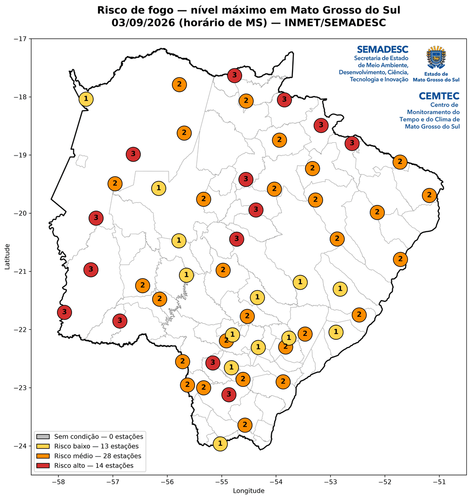 | 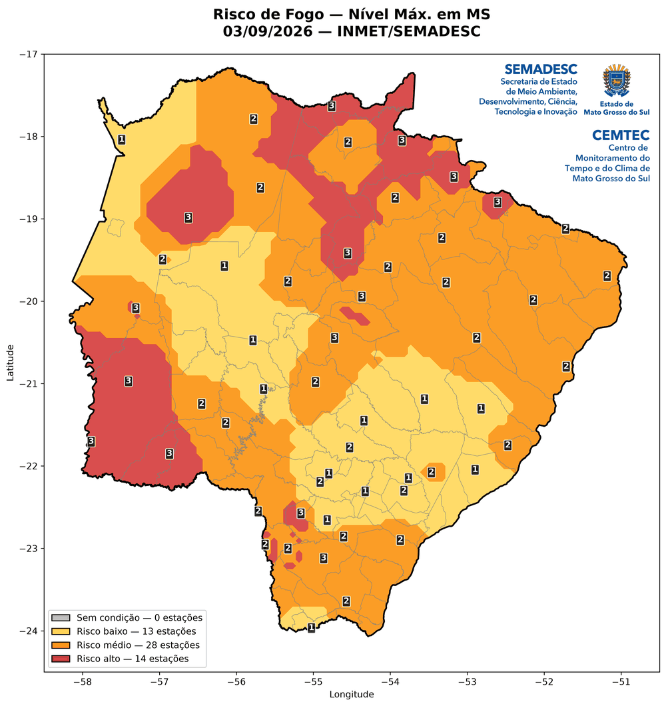 | 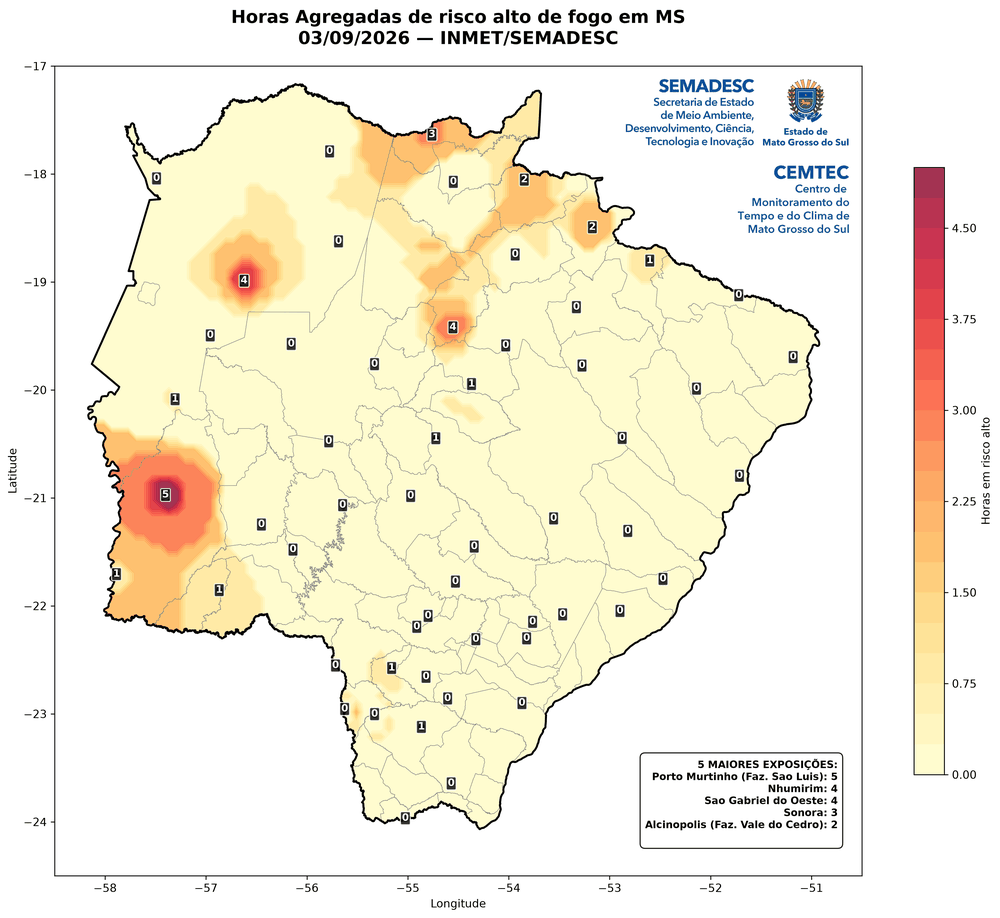 |

Os gráficos do período, na semana de 01 a 07/09/2026. O calendário mostra o episódio: 02 a 04/09 formam um bloco de risco alto, e a semana acalma depois.

| Horas em cada nível | Calendário estação × dia | Condições de um dia |
|---|---|---|
| 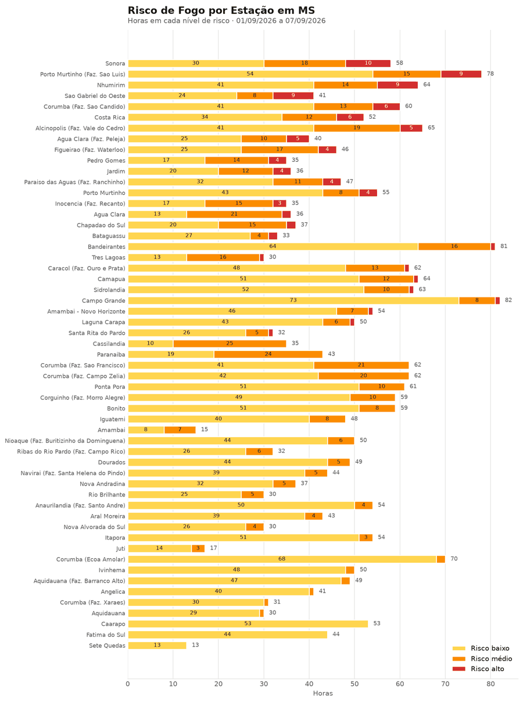 | 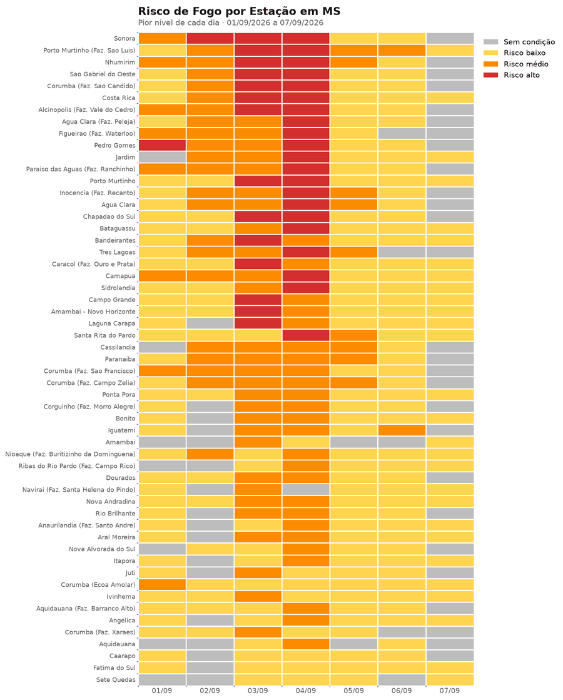 | 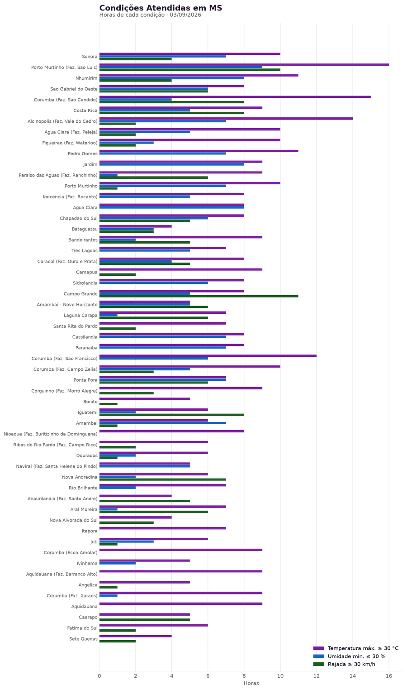 |

A evolução ao longo do dia, nos mapas horários. Em 03/09 o risco alto apareceu às 10h, se espalhou à tarde e desapareceu depois das 16h — por isso o dia rendeu sete mapas horários:

| 10h | 13h | 16h |
|---|---|---|
| 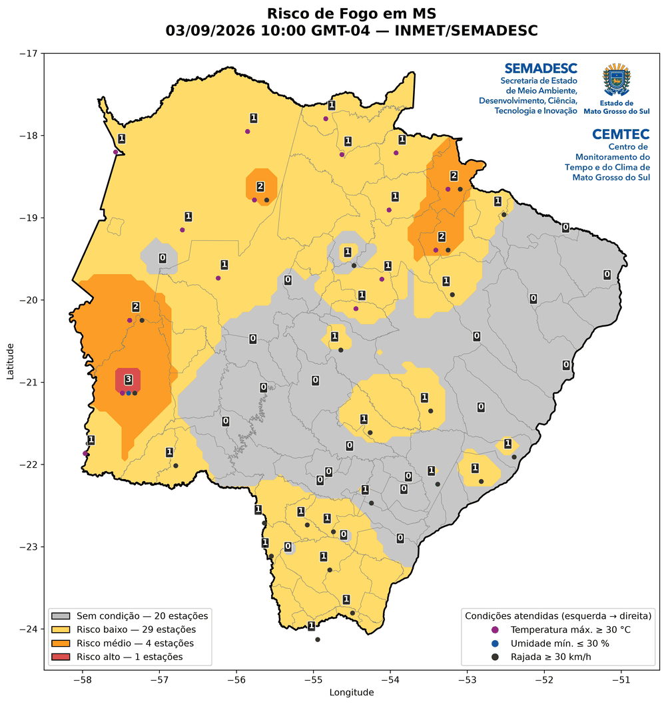 | 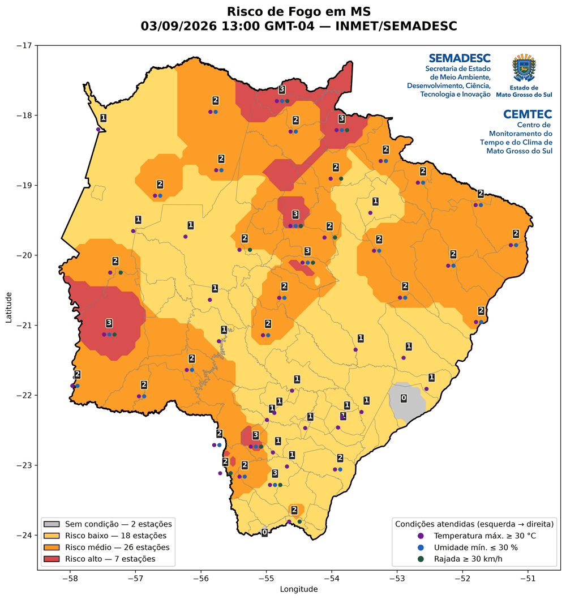 | 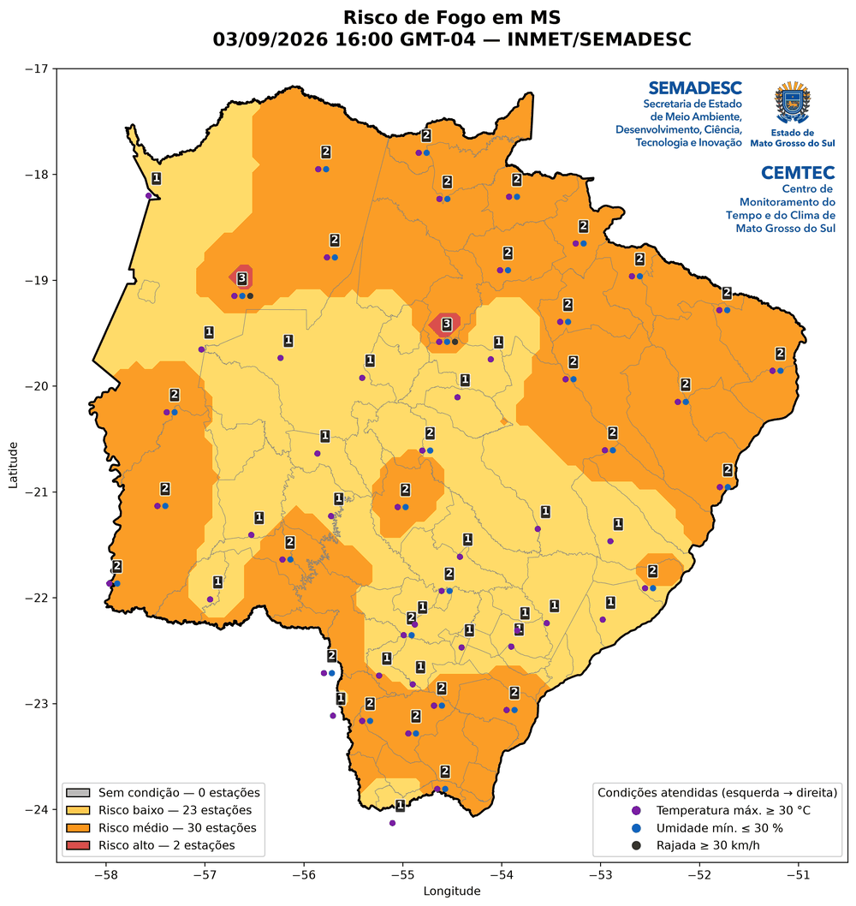 |

#### Dados de referência

- **API do INMET** (`apitempo.inmet.gov.br`)
  - `/estacoes/T` — lista de estações automáticas (sem token)
  - `/token/estacao/{data_ini}/{data_fim}/{codigo}/{token}` — dados horários de uma estação
  - Variáveis usadas: `TEM_MAX`, `UMD_MIN` e `VEN_RAJ`
- **Limiares, cores e rótulos** ficam em [`modulos/config.py`](modulos/config.py): `LIMIAR_TEMP_MAX`, `LIMIAR_UMIDADE_MIN`, `LIMIAR_RAJADA`, `CORES_RISCO`, `ROTULOS_RISCO`, `NIVEL_MAPA_HORARIO` e `CORES_CONDICOES` (cores dos pontos das condições).
- **Shapefiles**: `MS_UF_2022` (limite estadual, malha IBGE 2022) e `MS_mun_simplificado` (limites dos 79 municípios). Detalhes em [Estrutura do repositório](#shapefiles).

#### Notas metodológicas

- **Horários e leituras:** como no `relatorio_inmet`, os dados chegam em UTC e são exibidos no horário de MS, e cada leitura se refere à hora que termina no horário indicado.
- **Limiares inclusivos:** exatamente 30 °C, 30 % ou 30 km/h já contam como condição atendida.
- **Rajada:** `VEN_RAJ` vem em m/s e é convertida para km/h (× 3,6) antes da comparação — 30 km/h equivalem a 8,33 m/s.
- **Simultaneidade:** a regra é testada dentro de cada leitura horária, que traz a temperatura máxima, a umidade mínima e a rajada daquela hora. Dentro de uma mesma hora, os três valores podem estar separados por alguns minutos: é a resolução mais fina que a API oferece.
- **Interpolação:** mesmo IDW do `relatorio_inmet` (8 vizinhos, distância em km, grade de 100 × 100), aplicado **a cada hora e a cada variável separadamente**; a regra 30-30-30 é aplicada depois, ponto a ponto. Interpolar o nível 0–3 diretamente produziria valores sem sentido físico ("1,7 condições") e espalharia risco médio onde nenhuma estação o registrou. Horas com menos de 3 estações não são interpoladas.
- **Mapas de síntese interpolados:** saem da pilha de mapas horários — o nível máximo é o maior nível de cada ponto ao longo das horas, e as horas em risco alto são quantas vezes cada ponto chegou ao nível 3.
- **Pontual e interpolado podem discordar**, e isso não é erro: a superfície pode mostrar nível 2 num lugar onde nenhuma estação chegou a 2, porque ela vem das variáveis interpoladas, e não dos níveis das estações.
- **Rajada é a variável menos confiável do mapa interpolado:** vento de rajada é muito local, então a superfície de vento é mais incerta que as de temperatura e umidade.
- **Estações incompletas:** estações a que falte temperatura, umidade ou rajada ficam de fora e são listadas ao rodar — incluí-las subestimaria o risco, já que nunca poderiam alcançar o nível 3.

#### Mudanças em relação aos scripts legados

Não se aplica: o `risco_fogo` é um produto novo, desenvolvido a partir do pedido da equipe de meteorologia, sem script legado de origem.

#### Decisões da equipe de meteorologia

O método foi definido em **16/09/2026** a partir do pedido da equipe (questões 6 a 8 de [`docs/questoes_meteorologia.md`](docs/questoes_meteorologia.md)):

- Regra avaliada hora a hora, e não sobre os extremos do período.
- Três variáveis interpoladas separadamente, com a regra aplicada ponto a ponto.
- Somente data específica e tempo real; período fica para os gráficos de uma etapa futura.
- Mapas de síntese (nível máximo e horas em risco alto) em versão pontual e interpolada, sempre gerados; mapas horários só interpolados, apenas nas horas com alguma estação em risco alto, ou todos com `--hrtodas`.
- A planilha conta as horas nos três níveis e traz o primeiro horário em risco médio e em risco alto: dá para acompanhar quando o risco começou a subir, mesmo nos dias que não chegam ao nível 3.
- As três condições têm o mesmo peso; estações sem uma das variáveis ficam de fora.
- Cores cinza, amarelo, laranja e vermelho (sem o par verde/vermelho, por causa do daltonismo).
- Nos mapas horários, pontos das condições atendidas abaixo de cada estação, em posição fixa (definido em 17/09/2026).
- No período, três gráficos: horas por nível, calendário de estação × dia e as condições de cada dia (definido em 21/09/2026).

Em **17/09/2026** a equipe confirmou duas aproximações do método: avaliar a simultaneidade dentro de cada hora (a janela mais fina que a API oferece) e manter a rajada na superfície interpolada, apesar de o vento ser muito local.

⚠️ **Ainda aguardam confirmação da meteorologia:** os limiares (≥ 30 °C, ≤ 30 %, ≥ 30 km/h) e o critério de gerar mapa horário só a partir do risco alto.

---

## Requisitos

- Python **3.10 ou superior**
- Token de acesso à API do INMET
- Conexão com a internet

Principais bibliotecas (lista completa em [`requirements.txt`](requirements.txt)):

| Biblioteca | Uso |
|---|---|
| `pandas` | Tabelas, datas e exportação para Excel |
| `requests` | Chamadas à API do INMET |
| `numpy` / `scipy` | Grade e interpolação IDW (`cKDTree`) |
| `geopandas` / `shapely` | Leitura dos shapefiles e recorte espacial |
| `matplotlib` | Geração dos mapas |
| `openpyxl` | Escrita e formatação da planilha Excel |
| `tzdata` | Fusos horários (obrigatório no Windows) |
| `python-dotenv` | Leitura do arquivo `.env` |

## Instalação

**Windows (PowerShell):**

```powershell
python -m venv .venv
.venv\Scripts\Activate.ps1
pip install -r requirements.txt
```

**Linux / macOS:**

```bash
python3 -m venv .venv
source .venv/bin/activate
pip install -r requirements.txt
```

## Como atualizar

Quem usa os scripts trabalha com uma cópia local do repositório, feita uma única vez com `git clone`. Quando sair uma versão nova, essa cópia não se atualiza sozinha: é preciso pedir.

Abra o terminal **dentro da pasta do projeto** e rode:

```bash
git pull
```

Pronto — os arquivos passam a ser os da versão nova. A pasta `saida/`, com os seus resultados, e o arquivo `.env`, com o token, não são tocados: os dois ficam fora do controle de versão.

Para ver em que versão você está:

```bash
git log --oneline -1
```

### Se o `git pull` reclamar de alterações locais

Se aparecer algo como *"Your local changes to the following files would be overwritten by merge: main.py"*, significa que o arquivo foi editado na sua máquina — normalmente para trocar o produto ou as datas no topo do `main.py`. O git não sobrescreve isso sem a sua autorização.

Para descartar a sua edição e ficar com a versão nova:

```bash
git checkout -- main.py
```

Depois, repita o `git pull`.

Para não passar por isso toda vez, prefira informar produto e datas **pela linha de comando**, em vez de editar o arquivo. Assim o `main.py` nunca muda na sua máquina:

```bash
python main.py --produto risco_fogo --dataini 20/09/2026
```

### Depois de atualizar

Se a atualização mexeu no `requirements.txt`, instale o que faltar, com o ambiente virtual ativo:

```bash
pip install -r requirements.txt
```

Vale também conferir a seção [Como usar](#como-usar): uma versão nova pode trazer produtos novos ou mudar o nome de alguma opção.

## Configuração

### Token do INMET

O token é lido do arquivo `.env`, na raiz do projeto:

1. Crie o `.env` a partir do modelo:

   ```powershell
   Copy-Item .env.example .env
   ```

   No Linux/macOS: `cp .env.example .env`.

2. Abra o `.env` e preencha `TOKEN_INMET` com o token da equipe:

   ```
   TOKEN_INMET=seu_token_aqui
   ```

Sem o token configurado, o `main.py` para com uma mensagem de erro antes de chamar a API.

> O `.env` contém credenciais e **nunca deve ser commitado** — ele já está no `.gitignore`. Em agendamentos ou servidores, o token também pode ser definido como variável de ambiente `TOKEN_INMET`, que tem prioridade sobre o `.env`.

### Logos

Os logos ficam em `img/`, em **PNG com fundo transparente** — uma imagem com fundo branco cobriria o mapa. A posição e o tamanho de cada um são definidos na lista `LOGOS`, em [`modulos/config.py`](modulos/config.py), como um retângulo `[x, y, largura, altura]` em fração da moldura do mapa: `(0, 0)` é o canto inferior esquerdo e `(1, 1)` o superior direito. O logo se ajusta ao retângulo mantendo a proporção e fica alinhado ao canto superior direito dele, no mesmo lugar em todos os mapas.

### Demais parâmetros

Ficam em [`modulos/config.py`](modulos/config.py): pastas, endereços, tempos limite e tentativas da API, resolução dos mapas, posição dos logos, parâmetros da interpolação e limiares do risco de fogo.

**O estado não é uma constante: é um `Recorte`.** A dataclass reúne o que faz um estado ser ele mesmo — sigla, nome, os dois shapefiles, o enquadramento e o **fuso** — e é ela que viaja nas chamadas (`carregar_base(recorte)`, `estacoes_do_recorte(recorte)`, `Periodo.de_datas(..., fuso=)`). Quem não passa nada recebe o padrão, que é MS, e nada muda. Não é uma variável global que se troca: o painel serve várias pessoas no mesmo processo, e a escolha de uma não pode mudar o mapa que a outra está olhando. O fuso está dentro do recorte porque é ele que decide onde o dia começa — MS (GMT-04) e Paraná (GMT-03) partem o mesmo dia em horas diferentes.

### Quando a API do INMET falha

É comum a API encerrar a conexão sem responder no meio de uma consulta. Nesse caso, a estação é consultada de novo até `TENTATIVAS` vezes (padrão: 3), dobrando a espera a cada tentativa. Se ainda assim não der certo, a execução continua com as demais estações e o resumo do fim separa as que ficaram de fora:

- **Sem leituras no período** — a estação respondeu, mas não tem dados nessas horas.
- **Falha na consulta** — não foi possível ler a estação. Ela pode ter dados: vale repetir a consulta mais tarde.

Erros de token (HTTP 4xx) não são repetidos, porque novas tentativas não resolvem.

## Testes

Os testes usam uma API do INMET simulada, então não precisam de token nem de internet:

```bash
pip install -r requirements-dev.txt
pytest
```

Rode os testes antes de cada commit: eles conferem as janelas de tempo, os cálculos, o acesso à API e a execução completa (Excel e mapas) de cada produto.

Os testes também rodam automaticamente no GitHub (GitHub Actions, em Linux, com Python 3.10 e 3.14) a cada push e a cada pull request para a `main`. O resultado aparece como ✓ ou ✗ ao lado de cada commit e na aba **Actions** do repositório, onde também é possível rodá-los manualmente.

## Explorador (Streamlit)

Ferramenta de **análise**, separada dos produtos: olha-se o dado para entender tendências e conferir a qualidade da medição, sem gerar os arquivos do relatório. Os produtos continuam saindo pelo `main.py`, e o explorador não altera nada do que eles produzem.

Instale as dependências dele uma vez (quem só gera os produtos não precisa disto):

```bash
pip install -r app/requirements.txt
```

A aba de mapa usa o mesmo `modulos/mapas.py` dos produtos, então a lista inclui as bibliotecas de geoprocessamento (geopandas, shapely, pyogrio, pyproj e scipy). São ~165 MB — o preço de não manter um segundo desenho de mapa, que com o tempo divergiria do relatório.

E abra:

```bash
streamlit run app/explorador.py
```

O navegador abre em `http://localhost:8501`. Na barra lateral ficam o **estado**, o período, as estações e as **grandezas**. O seletor de estado só oferece as UFs que têm shapefile em `shp/` — hoje, MS e MT; para acrescentar outra, rode `python ferramentas/simplificar_municipios.py --uf SIGLA`, que busca a malha do estado no IBGE (veja [Shapefiles](#shapefiles)). Trocar de estado troca junto o fuso (é ele que decide onde o dia começa), as estações e os shapefiles, e cada estado tem o seu lugar no cache: duas pessoas no mesmo painel, em estados diferentes, não veem o mapa uma da outra. Cada grandeza ganha o seu gráfico — escalas diferentes nunca se misturam num eixo só —, com as séries que a equipe de meteorologia definiu: no gráfico horário, a máxima, a mínima e a média da hora; no diário, as do dia mais a compensada. **Cor separa a estação, traço separa a série**, e clicar numa série da legenda deixa só ela no gráfico **e no balão** — Shift+clique na série destacada traz todas de volta. Zoom com Shift + roda, e tudo baixável em CSV. O cursor em **qualquer ponto** do gráfico marca a hora mais próxima com uma régua vertical e abre um balão só com **todas as estações daquele instante** — antes era preciso acertar o mouse em cima de um ponto, e o balão trazia uma linha de cada vez, que é justamente a comparação que não se queria fazer.

| | |
|---|---|
| **Grandezas** | Temperatura, umidade, pressão, vento e radiação — a chuva saiu para a aba dela, porque não vira linha. O que cada uma mostra — e com que regra — está no catálogo [`app/variaveis.py`](app/variaveis.py), e a regra vai escrita sob cada gráfico |
| **Horário ou diário** | O seletor **Agregação** fica dentro da aba, e não na barra lateral: ele vale só para os gráficos, e cada outra aba tem o seu. Na lateral parecia um filtro geral — e as outras abas o ignoravam |
| **A regra é da variável** | A estação mede de 10 em 10 minutos e transmite de hora em hora, já resumido: MAX e MIN são os extremos daquela hora, INS é a leitura da hora cheia, chuva e radiação são acumulados. Por isso **a máxima do dia é a maior das máximas horárias**, nunca a média delas — e não existe mais escolher "média, máxima, mínima ou soma" para qualquer variável |
| **Vento** | Velocidade e rajada aparecem em **km/h**, como nos produtos (a API manda em m/s). A **direção** sai em pontos, e não em linha: entre 350° e 10° o vento mal mudou, mas uma linha desceria o gráfico inteiro. Para o período há uma **rosa dos ventos** por estação, com as horas de cada rumo separadas por faixa de velocidade |
| **Cache** | O que já foi baixado fica em `cache/`, fora do controle de versão, para a tela responder rápido a cada filtro. Alargar o período baixa **só os dias que faltam**. O botão **Limpar cache** apaga tudo; o que faltar é baixado de novo |
| **A ponta recente nunca vem do cache** | O INMET publica a **linha da hora antes das medidas** e as preenche depois. Guardar essa linha como se fosse resposta final deixava o mapa da tarde em branco para sempre — e consultar de novo não adiantava, porque a linha estava lá. Por isso a cobertura é julgada pela última hora **que trouxe medida**, e dali até o fim da janela se consulta de novo (no máximo 48 h para trás, para uma estação que ficou fora do ar em julho não ser rebaixada inteira a cada consulta) |
| **A espera é de rede** | É uma consulta por estação, e são 62. Em fila, uma semana levava ~50 s e um mês, ~105 s — o processamento em si custa 0,2 s. As consultas saem **8 de cada vez** (`config.DOWNLOADS_SIMULTANEOS`), reaproveitando a conexão: a mesma semana sai em ~4 s. O limite é do processo inteiro, e não de cada pessoa que abre o painel — com 16 simultâneas o INMET derruba a conexão. Uma barra mostra quantas estações já chegaram |
| **Na nuvem começa do zero** | O Streamlit Cloud reconstrói o contêiner a cada publicação e quando o app acorda de um período parado, e o `cache/` vai junto. Quem abrir logo depois paga a consulta inteira; a partir daí vem do cache |
| **Baixar os dados** | O CSV traz **todas as colunas que a API devolve**, com os códigos do INMET, independente das grandezas escolhidas: inclusive as que nenhum gráfico usa, como a sensação térmica (`TEM_SEN`) e a tensão da bateria (`TEN_BAT`). A única coisa que não vem como a API mandou é o **vento, em km/h** — o painel converte ao carregar, como os produtos |
| **Onde roda** | Na sua máquina. Não é um serviço: cada pessoa abre o seu |

### Aba "Mapas Boletim"

O **mesmo mapa interpolado dos produtos** — mesma interpolação IDW, mesmo recorte pelo contorno do estado, mesmas cores —, só que sem a moldura institucional: na tela, título e logos tomariam o lugar do mapa. Na prática é o produto de mapa rodando pela tela, sem terminal: escolha o período e os mapas, ande no tempo e baixe o PNG.

| | |
|---|---|
| **Estações** | Todas as do estado, e não só as escolhidas na barra lateral: com duas ou três a superfície inventaria o estado inteiro. Por isso a aba começa com um botão — a primeira consulta demora, e depois vem do cache |
| **As vizinhas seguram a borda** | A interpolação usa também as estações **de fora do estado** que caem a até 1,5° do enquadramento — em MS são 54, de PR, MT, GO, SP e MG. Sem elas, os 8 vizinhos que o IDW enxerga numa célula da divisa estão todos para dentro, e a superfície extrapola tendo medição do outro lado. Medido numa hora real: na borda a temperatura muda até 4,5 °C e a umidade até 11,9 pontos; **no miolo, 0,01 °C** — o efeito é onde tinha de ser. Elas não viram ponto desenhado, rótulo, tabela, ranking nem opção na barra lateral: são insumo da conta, não resultado |
| **O que já vem escolhido** | O trio do boletim em cada agregação, de `variaveis.PADRAO_MAPA`: na hora, temperatura da hora cheia, umidade mínima e rajada; no dia e no período, temperatura média, umidade mínima e rajada máxima. No período a média é a **compensada** — de vários dias, é ela que é a média. Quem quiser outro troca no seletor |
| **Os valores já vêm escritos** | A caixa "Mostrar o valor de cada estação" nasce ligada: o mapa serve para ler número, não só padrão de cor. Onde os rótulos se cobrirem, amplie no ícone de tela cheia ou desligue a caixa |
| **Três modos** | **Hora a hora** mostra a leitura como a estação mandou; **por dia** e **período inteiro** mostram os produtos do boletim, cada um com a sua regra. O deslizante anda de hora em hora ou de dia em dia; no período inteiro não há deslizante, porque é um mapa só para a janela |
| **A escala de cores é fixa** | A mesma cor quer dizer o mesmo valor em qualquer mapa. Esticada ao dado de cada instante, ela enganava: num dia de 34 a 41 °C, os 36 °C saíam azuis e pareciam amenos. As faixas estão em [`app/variaveis.py`](app/variaveis.py) — temperatura 0 a 45 °C, umidade 0 a 100%, vento 0 a 130 km/h. Chuva e radiação vão por **classes**, escolhidas pela duração da janela, porque o acumulado de uma hora e o de um mês não cabem na mesma régua. A pressão é a exceção: fica ajustada ao dado, porque a API manda a pressão da estação, sem redução ao nível do mar, e entre altitudes diferentes o mapa desenharia o relevo |
| **Quando a escala atrapalha** | Num dia em que o estado inteiro fica entre 20 e 25 °C, a escala fixa deixa o mapa quase de uma cor só. A caixa **"Ajustar a escala ao dado"** devolve o contraste — com o custo de as cores mudarem de significado |
| **A régua embaixo** | Cada mapa traz a sua barra de cores deitada e fina, sob o desenho. Com escala fixa ela vale para qualquer mapa daquela grandeza |
| **A regra é da variável** | Não existe mais escolher "média, máxima, mínima ou soma" para qualquer coisa: a máxima do dia é a **maior das máximas horárias**, a chuva do dia é a **soma**, a umidade do mapa é a **menor mínima**. O catálogo com todas as regras está em [`app/variaveis.py`](app/variaveis.py), e a regra de cada mapa vai escrita embaixo dele |
| **Vários mapas lado a lado** | Os mapas escolhidos saem em linha, três por linha, no mesmo instante: dá para ver a temperatura alta bater com a umidade baixa sem trocar de tela |
| **O que o mapa mostra** | Neste tamanho, o **padrão**: a superfície interpolada e as estações como pontos. Barra de cores, grade de latitude e longitude e valor de cada estação saem do desenho — com 62 estações numa coluna de ~470 px eles se cobrem e viram borrão, e a moldura de coordenadas toma a borda inteira. A **faixa de valores** (mínimo e máximo do instante) vai escrita sob cada mapa, e a caixa **"Mostrar o valor de cada estação"** traz os números de volta, para ler ampliando no ícone de tela cheia |
| **Variáveis** | Todas, menos a direção do vento: interpolar ângulo entre 350° e 10° daria 180°, o rumo oposto. No mapa, direção se mostra com seta, como o relatório faz sobre a rajada |
| **Quando não desenha** | Se menos de 3 estações mediram naquele instante, a tela avisa em vez de mostrar uma superfície inventada |
| **Baixar PNG** | Um botão por mapa, com o mesmo desenho da tela em 150 dpi. Os mapas do relatório, com título, logos e ranking, continuam saindo pelo `main.py` |
| **GIF do período** | Um botão por mapa monta a **sequência** da janela — um quadro por hora (ou por dia), cada um com a data e a hora escritas dentro, porque fora do painel o GIF vira um arquivo solto. O mapa parado diz como estava naquela hora; a sequência mostra por onde a frente entrou. A escala de cores fica **travada no período inteiro**: esticada a cada quadro, as cores piscariam e quem olha veria variação onde não houve. Acima de 72 quadros ele passa a pular de tantas em tantas horas — o carimbo deixa o salto à vista. Fica atrás de um botão porque custa ~0,08 s por quadro |

### Aba "Risco de Fogo"

A regra **30-30-30** na tela, com o mesmo código do produto: `modulos/produtos/risco_fogo.py` é
importado, não copiado. Duas implementações da regra divergiriam com o tempo, e aí a tela e o
relatório diriam números diferentes sobre a mesma hora. `app/risco.py` só traduz o formato — o
produto trabalha com uma lista de `(estação, leituras)`, o painel com uma tabela longa.

| | |
|---|---|
| **A regra** | Conta quantas das três condições valem **em cada hora**: temperatura máxima ≥ 30 °C, umidade mínima ≤ 30 % e rajada ≥ 30 km/h. Hora a hora porque os extremos do dia acontecem em horários diferentes: 32 °C às 15 h, 28 % às 18 h e rajada às 03 h não são um dia de risco alto. Os limiares foram confirmados pela equipe em 28/09/2026 |
| **O dado é o mesmo dos mapas** | Mesma janela, mesma chave de cache: se a pessoa já carregou a aba **Mapas Boletim**, o risco não consulta a API de novo |
| **Hora a hora** | Deslizante + o mapa em quatro classes, com o botão de GIF. A caixa **"só as horas em que alguma estação chegou ao risco alto"** faz o deslizante parar só nelas. O critério é o nível **medido**: a superfície pode mostrar nível 2 numa célula onde nenhuma estação chegou a 2 |
| **Por dia** | O **pior** nível que cada lugar alcançou no dia — um dia é de risco alto se houve uma hora em que as três condições valeram juntas |
| **Período inteiro** | O pior nível da janela, as **horas em risco alto** célula a célula, e a tabela por estação com as mesmas colunas da planilha do produto (CSV) |
| **Três gráficos** | Horas em cada nível, o calendário do pior nível de cada dia, e as condições atendidas de um dia — o gráfico que responde se o risco veio do calor, da secura ou do vento. A ordem das estações é a mesma nos três, para dar para comparar |
| **Interpolação** | As três variáveis são interpoladas **separadas** e a regra é aplicada célula a célula. Interpolar o nível 0–3 direto produziria "1,7 condições" e espalharia risco médio onde estação nenhuma o registrou |
| **Custo** | Três interpolações por hora, 31 ms cada: uma semana sai em ~5 s, com barra de progresso, e fica em cache |

### Aba "Chuva"

Todos os mapas de chuva ficam aqui, e não junto dos outros, por um motivo de fundo: **a chuva é a única grandeza que precisa de dado fora do período escolhido**. Um acumulado de 96 h, ou o do mês, começa antes do início da janela da barra lateral. Nas outras abas, todo mapa respeita o período; misturar um que espia fora dele geraria exatamente a dúvida que o catálogo veio matar.

| | |
|---|---|
| **Cascata** | Abre a aba, e vale para as **estações escolhidas na barra lateral** — é a leitura por estação, não do estado. Cada barra é a chuva daquele passo, empilhada no que já tinha caído, e a barra escura no fim é o total, saindo do chão para comparar de relance. No horário mostra as últimas 24 horas; no diário, um dia por barra. O **rótulo só vai onde choveu**: num período seco seriam dezenas de zeros cobrindo justamente as barras que interessam. Vinha da aba de séries, e está aqui porque é chuva — e porque não depende da consulta do mês, que é o que segura o resto da aba |
| **Até quando** | Um deslizante no topo escolhe o **instante de referência**, e toda janela conta para trás a partir dele. Sem isso ficava a dúvida de quem olha: "acumulado de 24 h, mas até que dia?" |
| **Cascata do estado** | A mesma forma, mas **sem depender de escolha nenhuma na barra lateral**: uma barra por passo com a **soma de todas as estações do estado**, presa ao deslizante de referência. No diário vai do começo da carga até o instante escolhido; no horário, as últimas 24 h. Sai do dado que os acumulados já baixaram, então não custa consulta nova |
| **A soma não é a chuva de um lugar** | O número da cascata do estado é milímetro de estações diferentes somado. No MT, numa semana em que a estação mais molhada recebeu 74,8 mm, a soma das 51 deu **742,8**. Serve para ler o **ritmo** — quando choveu, e quanto do total veio de cada dia. Para quanto caiu **onde**, são os acumulados e o mapa. A legenda na tela diz isso; a equipe escolheu a soma sabendo disso, em vez da média das estações (14,6 mm) ou da média da área interpolada (14,1 mm) |
| **Acumulados** | 3, 6, 12, 24, 48, 72, 96 h e o **mensal**, que começa no dia 1º |
| **Barra primeiro, mapa sob demanda** | A barra diz **quanto** choveu em cada estação, ordenado — é o número que vai para o texto do boletim. O mapa diz **onde** choveu, e custa um desenho por janela no servidor; por isso fica atrás da caixa "Gerar também os mapas". A lista traz as 15 que mais choveram, e só quem choveu: numa janela seca, quinze barras de 0,0 mm não dizem nada |
| **A carga é maior** | Por isso a aba tem o seu próprio botão: a consulta vai até o começo do mês (ou 96 h atrás, o que for mais antigo) |
| **Quando não fecha** | Se o dado carregado não alcança o começo de uma janela, a tela avisa e não desenha aquele mapa — um acumulado de 96 h feito com 48 h de dado mostraria metade da chuva como se fosse o total |
| **Hora a hora e por dia** | Também estão aqui, e esses respeitam o período escolhido, como as outras abas |

### Aba "Mapa Navegação"

Em avaliação. A **mesma superfície** da aba anterior — mesma interpolação IDW sobre as mesmas 62 estações —, mas desenhada sobre um mapa base que se aproxima e arrasta, com as cidades e as estradas por baixo. Passando o mouse numa estação sai o nome e o valor; o enquadramento sobrevive a andar no tempo, então dá para aproximar numa região e seguir as horas ali.

O que ela custa, e por isso está em teste:

- **É um segundo desenho de mapa.** O compartilhado é a conta (`modulos/calculos.py`); a tela e o relatório podem divergir com o tempo.
- **O mapa base vem do Carto**, fora da SEMADESC: o navegador de cada pessoa busca as imagens lá.
- **Convida a aproximar mais do que o dado permite.** São 62 estações, não a grade de um modelo: ampliada até o município, a interpolação parece mais segura do que é. O mapa de escala fixa do relatório é honesto quanto à sua resolução.

A decisão — substituir a aba `Mapa`, conviver com ela ou não valer a manutenção — depende de a equipe usar o explorador para **explorar** ou para **conferir e baixar** o mapa do relatório.

### Aba "Qualidade dos dados"

Conferências que nenhum produto faz — os produtos calculam em cima do que a API mandou; aqui a pergunta é se dá para confiar nesse dado. Dá para analisar só as estações escolhidas ou **todas as de MS** de uma vez.

| Verificação | O que procura |
|---|---|
| **Completude por dia** | Quanto das 24 horas de cada dia a estação registrou |
| **Completude por variável** | A estação pode registrar a hora e mesmo assim não medir tudo: é aqui que aparece o sensor que parou sozinho |
| **Valores impossíveis** | Leituras fora da faixa plausível (umidade acima de 100%, pressão fora de 800–1100 hPa) |
| **Sensores travados** | A mesma leitura repetida por 6 horas ou mais em temperatura, umidade ou pressão. Chuva e vento ficam de fora: zero repetido ali é normal |
| **Bateria** | Tensão mínima da estação no período; abaixo de 11,5 V costuma anteceder a estação sair do ar |

Radiação levemente negativa à noite é ruído conhecido do sensor, não defeito — por isso tem uma coluna própria e não entra como valor impossível.

> Se você alterar um arquivo de `app/`, o Streamlit recarrega a tela mas **não** os módulos importados. Pare com `Ctrl+C` e rode de novo.

> Para o dia em curso, as horas mais recentes podem não estar no cache. Se precisar do dado de agora, limpe o cache ou consulte de novo mais tarde.

## Novos produtos

Os scripts da equipe estão sendo migrados aos poucos. Cada um vira um produto em `modulos/produtos/`, reaproveitando as peças compartilhadas (API do INMET, períodos, cálculos, mapas e Excel). O passo a passo está em [`docs/como_migrar_um_script.md`](docs/como_migrar_um_script.md).

Cada produto ganha a sua seção em [Como usar](#como-usar), sempre com as mesmas subseções, nesta ordem: **O que calcula**, **Como rodar**, **modos de tempo aceitos**, **Saídas**, **Exemplos**, **Dados de referência**, **Notas metodológicas**, **Mudanças em relação aos scripts legados** e **Decisões da equipe de meteorologia**. As imagens dos exemplos ficam em `docs/img/<produto>/`, reduzidas para cerca de 1000 px de largura.

## Estrutura do repositório

```
.
├── main.py               # Ponto de entrada: escolha do produto e das datas
├── modulos/              # Peças compartilhadas por todos os produtos
│   ├── config.py         # Configurações, o Recorte (o estado mapeado) e o Periodo (janelas de tempo)
│   ├── inmet.py          # Acesso à API do INMET (estações e dados horários)
│   ├── calculos.py       # Recorte no tempo, extremos, acumulados e interpolação IDW
│   ├── mapas.py          # Mapas pontuais, interpolados e de classes (níveis de risco)
│   ├── graficos.py       # Gráficos de barras e calendário, com o estilo comum aos produtos
│   ├── excel.py          # Planilha Excel
│   └── produtos/         # Um arquivo por produto
│       ├── relatorio_inmet.py  # Extremos e chuva das estações automáticas
│       └── risco_fogo.py       # Risco de fogo pela regra 30-30-30, hora a hora
├── app/                  # Explorador em Streamlit (análise), com o seu cache local em cache/
│   ├── explorador.py     # A tela: filtros, gráficos, mapa e verificações de qualidade
│   ├── dados.py          # Coleta com cache, usada só pelo explorador
│   ├── variaveis.py      # Catálogo do que se pode mapear e traçar, com a regra de cada um
│   ├── animacao.py       # GIF do mapa no tempo: quais quadros entram e o carimbo de cada um
│   ├── chuva.py          # Acumulados que olham para trás do período e a cascata
│   ├── risco.py          # Risco de fogo na tela: traduz o formato para a regra do produto
│   ├── superficie.py     # Superfície interpolada como imagem, para o mapa navegável
│   ├── qualidade.py      # Regras de qualidade das leituras (sem tela, por isso testáveis)
│   └── requirements.txt  # Dependências só do explorador
├── ferramentas/          # Scripts auxiliares (ex.: preparar os shapefiles de um estado)
├── tests/                # Testes automatizados (pytest), com a API do INMET simulada
├── .github/workflows/    # Execução automática dos testes no GitHub (GitHub Actions)
├── docs/                 # Documentos da equipe (ex.: questões para a meteorologia, guia de migração)
│   └── img/              # Mapas de exemplo usados neste README, um subdiretório por produto
├── shp/                  # Shapefiles de cada estado: limite estadual e municípios
├── img/                  # Logos inseridos nos mapas (PNG com fundo transparente)
├── saida/                # Resultados gerados (fora do controle de versão)
├── legado/               # Scripts originais de cada produto (ex.: legado/relatorio_inmet/), para comparação
├── requirements.txt
├── requirements-dev.txt  # Dependências de desenvolvimento (testes)
├── pytest.ini            # Configuração dos testes
├── .env                  # Token do INMET (local, fora do controle de versão)
├── .env.example          # Modelo do arquivo .env
└── README.md
```

### Shapefiles

Todos os mapas usam os shapefiles de `shp/` (SIRGAS 2000, EPSG:4674, reprojetados para WGS 84/EPSG:4326 na execução). São **dois por estado**, e é a existência deles que faz a UF aparecer no seletor do painel e na lista de `--uf` do `main.py`:

- `<UF>_UF_2022` — limite estadual (malha IBGE 2022). Enquadra o desenho e recorta a superfície interpolada.
- `<UF>_mun_simplificado` — limites municipais, só para traçar as linhas cinzas. Simplificados com tolerância de 0,001° (~100 m, menos de meio pixel): sem diferença visível no mapa e bem mais leves de desenhar. Cada município é simplificado por conta própria, então as divisas entre vizinhos podem ter frestas de poucos metros — servem para desenhar, não para medir área.

Prontos hoje: **MS** e **MT**. Para acrescentar um estado:

```bash
python ferramentas/simplificar_municipios.py --uf GO
```

A ferramenta baixa a malha de 2022 do IBGE, que publica um arquivo por UF, guarda o bruto em `shp/fonte/` — fora do git, porque é grande e o IBGE o devolve quando precisar — e grava em `shp/` só os dois arquivos que os mapas leem. Versionar esses dois é obrigatório: a nuvem do Streamlit clona o repositório e não tem como baixar nada na hora de desenhar.

MS é a exceção: o municipal dele (`MS_mun`, os 79 municípios com ~755 mil vértices) é um arquivo da equipe, e não a malha do IBGE. Quando existe uma fonte local `<UF>_mun.shp`, é ela que vale. Se essa malha for atualizada, substitua os `MS_mun.*` e gere de novo com `--refazer`.

> Cada shapefile é formado por vários arquivos com o mesmo nome (`.shp`, `.shx`, `.dbf`, `.prj`, `.cpg`), que precisam ficar juntos na mesma pasta.
