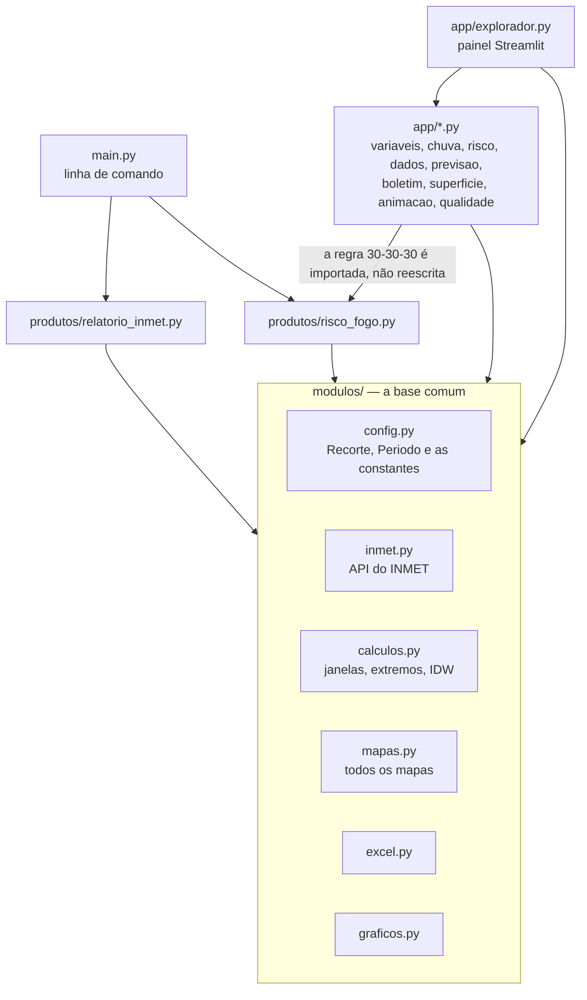

# Guia de manutenção

Para quem vai mexer no código: o que existe, como as peças se encaixam e onde mexer para cada tipo de mudança. O [README](../README.md) descreve o projeto do ponto de vista de quem **usa**; este guia é para quem **mantém**.

Uma leitura de ponta a ponta leva uns 20 minutos. Depois, ele serve de consulta: as seções 6 (receitas) e 8 (armadilhas) são as que mais se volta a abrir.

**Sumário**

1. [O projeto em um minuto](#1-o-projeto-em-um-minuto)
2. [Seis ideias que atravessam tudo](#2-seis-ideias-que-atravessam-tudo)
3. [O caminho de um `python main.py`](#3-o-caminho-de-um-python-mainpy)
4. [O caminho do painel](#4-o-caminho-do-painel)
5. [Arquivo por arquivo](#5-arquivo-por-arquivo)
6. [Receitas: onde mexer para cada mudança](#6-receitas-onde-mexer-para-cada-mudança)
7. [Testes](#7-testes)
8. [Armadilhas conhecidas](#8-armadilhas-conhecidas)
9. [Versões, branches e publicação](#9-versões-branches-e-publicação)
10. [Onde está o porquê de cada coisa](#10-onde-está-o-porquê-de-cada-coisa)

---

## 1. O projeto em um minuto

São **duas portas de entrada** sobre **uma base comum**:

- **`main.py`**, a linha de comando: gera os **produtos** (planilha Excel e mapas em PNG) que vão para o boletim. É o que a equipe mais usa.
- **`app/explorador.py`**, o painel em Streamlit: serve para **olhar** os dados (gráficos, mapas, qualidade). Ele não grava nada em `saida/`.

As duas usam o mesmo código de `modulos/`: a mesma API, as mesmas contas e o mesmo desenho de mapa. É por isso que a tela e o relatório não discordam.



A regra de dependência é uma só: **`modulos/` nunca importa nada de `app/`**. O painel conhece os produtos, mas os produtos não sabem que o painel existe. Mantida essa regra, o `main.py` roda sem Streamlit instalado.

E uma segunda, desde a v0.3.1: **os produtos e o painel pedem os dados ao `modulos/fonte.py`, e nunca direto ao `inmet.py`.** É o `fonte.py` que decide de onde vêm as leituras, pela configuração `FONTE_DADOS`: hoje só existem as APIs públicas, e o banco da UNIGEO e a API de leitura chegam nas próximas versões ([`plano_arquitetura.md`](plano_arquitetura.md)). Um teste (`test_produtos_e_painel_pedem_os_dados_a_fonte_e_nao_ao_inmet`) falha se alguém passar por fora.

Tamanho de cada parte, para ter noção do que se está mantendo:

| Parte | Linhas | O que tem |
|---|---|---|
| `modulos/` (base e produtos) | ~2.100 | `config`, `inmet`, `calculos`, `mapas`, `excel`, `graficos` e os dois produtos |
| `app/explorador.py` | ~2.000 | a tela inteira do painel: as duas páginas, e o observado aba por aba |
| `app/*.py` (os outros) | ~1.300 | as contas do painel, sem tela, por isso testáveis |
| `tests/` | ~3.300 | 299 testes, que rodam em ~50 s |

---

## 2. Seis ideias que atravessam tudo

Entendidas estas seis, o resto do código se lê sozinho.

### 2.1 O `Recorte`: qual estado é

`config.Recorte` reúne tudo o que muda de um estado para outro: a sigla, o nome, os dois shapefiles, o **enquadramento** do mapa (`limites`) e o **fuso**. Ele é passado de função em função (`carregar_base(recorte)`, `estacoes_do_recorte(recorte)`…), e não lido de uma constante global. É isso que deixa duas pessoas olharem estados diferentes no mesmo painel, ao mesmo tempo.

- `config.recorte_de("SC")` monta o recorte de qualquer UF que tenha shapefile em `shp/`. O de MS é escrito à mão em `config.RECORTES`, com o enquadramento de sempre. O dos outros é derivado do contorno, mais uma margem de 0,35°.
- `config.ufs_disponiveis()` lista as UFs que têm shapefile, e é isso que aparece no seletor do painel e no `--uf`.
- Quem não passa recorte recebe o padrão, `config.RECORTE`, que é MS.

### 2.2 O `Periodo` e a regra de ouro das janelas

`config.Periodo` é a janela de uma consulta: `inicio`, `fim`, `modo` (`"dia"`, `"periodo"` ou `"tempo_real"`) e `fuso`. Ele é criado por `Periodo.de_datas(...)` ou `Periodo.tempo_real(...)`.

Duas convenções valem **no projeto inteiro**, e a maioria dos defeitos já corrigidos foi alguém escorregando numa delas:

1. **Toda janela é `(início, fim]`.** Cada leitura do INMET resume a hora que **termina** nela: a leitura das 15:00 cobre de 14:00 a 15:00. Por isso entra a leitura do fim e não a do início.
2. **A leitura das 00:00 fecha o dia anterior.** O dia 17/09 vai da leitura da 01:00 de 17/09 até a das 00:00 de 18/09. Quem agrupa por dia sem recuar essa hora transforma uma semana em oito dias, o último com uma leitura só. As funções que já fazem isso certo: `risco_fogo.dia_da_leitura`, `qualidade.dia_da_leitura`, `variaveis._fatias`, `chuva._comeco_do_mes`.

E o dia é o **do estado**: o fuso vem do recorte (MS e MT em GMT-04, PR e SC em GMT-03), e é ele que decide onde o dia começa.

### 2.3 Estações do estado e estações de apoio (as vizinhas)

Os mapas interpolados usam também as estações de **fora** do estado que podem estar entre as 8 mais próximas de alguma célula do mapa. São as **vizinhas**, ou **apoio**. Sem elas, na divisa o IDW só enxerga estações de um lado e extrapola.

A regra é rígida: **o apoio entra só na superfície**. Ele não vira ponto desenhado, linha de planilha, ranking, nem critério de qual hora ganha mapa no risco de fogo. E a escala de cores fica presa na faixa que o estado faria sozinho (`mapas.mapa_interpolado`).

- Quem escolhe as vizinhas é `inmet.estacoes_de_apoio`: elas precisam cair a até 1,5° do enquadramento e chegar às 16 mais próximas de alguma célula (`config.VIZINHOS_NA_PODA`, o dobro do que o IDW usa, por folga).
- Painel e produtos usam a **mesma** função, então a tela e o boletim saem das mesmas estações.
- Se a lista falhar, `inmet.baixar_apoio` avisa e devolve vazio, e o produto sai só com as do estado.

### 2.4 Unidades: o vento chega em m/s

A API manda velocidade e rajada em **m/s**. O projeto mostra tudo em **km/h**, e a conversão é feita **uma vez só**, em lugares conhecidos:

- no `relatorio_inmet`, dentro de `resumir_estacao` (`VEN_RAJ * 3.6`);
- no `risco_fogo`, em `leituras_validas` (coluna `rajada_kmh`);
- no painel, ao carregar, por `CONVERSOES` no topo do `explorador.py`. Daí em diante, todo o painel já trabalha em km/h.

O perigo é converter duas vezes: `app/risco.py` recebe o dado do painel, que já está em km/h, e um teste trava isso (`test_a_rajada_nao_e_convertida_de_novo`). Converter de novo daria 130 km/h num dia calmo.

### 2.5 Um desenho de mapa, duas molduras

Todo mapa sai de `modulos/mapas.py`. O que muda entre o relatório e a tela é a **moldura**:

- **Sem `Tela`** (o caminho do `main.py`): título, subtítulo com "INMET/SEMADESC", logos, ranking das 5 estações, barra de cores vertical e grade de latitude e longitude.
- **Com `mapas.Tela(...)`** (o caminho do painel): só o desenho, para caber numa coluna.

O botão "Baixar PNG do boletim" do painel chama o caminho **sem** `Tela`, com as cores da tela. O texto da moldura vem de `app/boletim.py`.

O que vai num mapa é descrito por uma especificação: `EspecMapa` para valores contínuos (coluna, título, paleta, unidade, ranking, setas de vento) e `EspecClasses` para classes, como os níveis de risco.

### 2.6 No painel, a regra é da variável

`app/variaveis.py` é o **catálogo** do painel. Cada `Produto` ("Temperatura máxima", "Rajada na hora"…) diz de que colunas da API ele sai, em que modos existe (hora, dia, período), qual conta o define e a frase da regra, que vai impressa na tela. Ninguém escolhe "média" ou "máxima" na tela: a máxima do dia é **sempre** a maior das máximas horárias. O mapa e o gráfico usam a mesma regra, então não podem discordar.

O catálogo também decide a **escala de cores** (`variaveis.escala`): temperatura de 0 a 45 °C, umidade de 0 a 100%, vento de 0 a 130 km/h, e a chuva por classes que dependem da duração da janela.

---

## 3. O caminho de um `python main.py`

```bash
python main.py --produto relatorio_inmet --uf MS --dataini 29/09/2026
```

1. **`main.py` → `ler_consulta()`**: lê os argumentos, ou as variáveis no topo do arquivo quando eles faltam. Devolve três coisas: o **módulo do produto** (de `PRODUTOS`, que associa o `NOME` de cada produto ao seu módulo), o **`Periodo`** (com o fuso do recorte) e as **`opcoes`** (`{"recorte": ..., "hrtodas": ...}`).
2. **`main.executar()`**: confere se o token está no `.env` e chama `produto.executar(periodo, opcoes)`. **Todo produto tem essa mesma assinatura**: é o contrato que o `main.py` conhece.
3. Dentro do produto, no `relatorio_inmet.executar`:
   1. `fonte.leituras_do_estado(...)`, que hoje repassa ao `inmet.baixar_estacoes`, lista as estações operantes da UF (as em pane ficam de fora) e baixa as leituras de cada uma, **uma por vez**, com até 3 tentativas por consulta. Devolve uma lista de pares `(estação, leituras)` e imprime quem ficou de fora e por quê.
   2. `resumir_estacao` calcula, para cada estação, os extremos e os acumulados da janela, com `calculos.recortar`, `indice_extremo` e `acumulado_chuva`.
   3. `montar_tabelas` monta uma tabela por aba do Excel, ordenada.
   4. `excel.salvar_relatorio` grava a planilha.
   5. `mapas.carregar_base(recorte)` lê os shapefiles e monta a grade. `_tabelas_de_apoio` baixa as vizinhas e faz as mesmas tabelas para elas.
   6. `mapas.gerar_mapas(tabelas, especificacoes_mapas(...), ...)` desenha, para cada especificação, o mapa pontual e o interpolado.
4. O `risco_fogo.executar` segue o mesmo esqueleto, com a conta própria no meio:
   1. `leituras_validas` guarda só as horas com as três variáveis, já com a rajada em km/h.
   2. `analisar_horas` avalia cada hora: `estacoes_na_hora` dá o nível de cada estação naquela hora, e `grade_da_hora` interpola as **três variáveis separadas** e aplica a regra célula a célula.
   3. `resumir_estacao` e `montar_tabela` montam a planilha.
   4. `gerar_mapas` desenha os mapas de síntese e os horários, e `gerar_graficos` os gráficos, só no período.

Tudo vai para `saida/<produto>/<modo>/<identificador>/` (`Periodo.pasta_saida`), que fica fora do git.

---

## 4. O caminho do painel

### 4.1 Como o Streamlit roda

O Streamlit **executa o `explorador.py` inteiro, de cima a baixo, a cada clique**. Não há "eventos": mexer num filtro faz o script rodar de novo, e é o cache que impede que isso refaça tudo. Três mecanismos seguram o estado:

| Mecanismo | Onde | Para quê |
|---|---|---|
| `@st.cache_data` | `carregar_leituras`, `mapa_do_instante`, `risco_avaliado`… | Guarda o **resultado** pela combinação de argumentos, e devolve uma cópia. Argumentos com `_` na frente não entram na chave. |
| `@st.cache_resource` | `base_cartografica`, `malha_fina`, `guarda_da_previsao` | Guarda o **mesmo objeto**, sem copiar: os shapefiles, que são pesados, e a previsão guardada por rodada, que é uma só para todos. Tem `max_entries=3` porque esse cache é **do processo**, compartilhado por todo mundo na nuvem. Um teste exige o teto. |
| `st.session_state` | botões "Gerar GIF", "Carregar todas as estações"; os filtros da barra lateral | Lembra que um botão já foi apertado, entre uma execução e outra, e o que se escolheu nos filtros quando se troca de página (`lembrar_filtros`). |

Além disso, há o **cache em disco** de `app/dados.py`: um `cache/<código da estação>.pkl` por estação, fora do git. Alargar o período baixa só os dias que faltam. As horas recentes que chegaram sem medida são consultadas de novo, porque o INMET publica a linha da hora antes de preenchê-la.

### 4.2 Como o `explorador.py` está organizado

É o maior arquivo do projeto, mas segue uma ordem fixa. Para achar uma aba, procure por `with aba_`:

| Linhas (aprox.) | O que tem |
|---|---|
| 1–120 | imports e constantes da tela (`DPI_MAPA`, `MAPAS_POR_LINHA`, `CONVERSOES`, `ESTADOS_NA_MEMORIA`…) |
| 120–945 | funções: as carregadas em cache (`carregar_*`, `mapa_do_*`, `gif_*`) e os pedaços de tela reutilizados (`painel_do_mapa`, `painel_da_chuva`, `botao_do_boletim`…) |
| ~949 | **PREVISÃO**: as páginas da previsão (`pagina_previsao`, os gráficos; `pagina_mapas_previstos`, os mapas dos dias; `pagina_semanas`, as anomalias do EC46), as funções delas e `lembrar_filtros` |
| ~1561 | **PÁGINAS**: `st.navigation`, com o observado e o grupo da previsão. Na previsão, o script para aqui; o observado é o resto do arquivo. |
| ~1585 | **FILTROS**: a barra lateral do observado (estado, período, estações, grandezas, cache) |
| ~1653 | **DADOS**: converte as datas do estado em UTC e carrega as estações escolhidas |
| ~1682 | `with aba_series:` — Séries Temporais |
| ~1756 | `with aba_mapa:` — Mapas Boletim. O botão carrega **todas** as estações do estado mais as vizinhas. |
| ~1855 | `with aba_chuva:` — Chuva. Tem carga própria, porque os acumulados olham para trás do período. |
| ~2042 | `with aba_risco:` — Risco de Fogo. Usa o mesmo dado da aba de mapas. |
| ~2240 | `with aba_navegavel:` — Mapa Navegação (pydeck), em avaliação |
| ~2339 | `with aba_qualidade:` — Qualidade dos dados |

**As páginas.** O painel tem o "Observado (INMET)" e, no grupo "Previsão (MS)", as "Estações", os "Mapas" e as "Semanas", trocadas no topo da barra lateral. O Streamlit apaga o valor de um widget que não aparece numa execução, e cada página aparece sozinha: sem cuidado, ir à previsão e voltar perderia as estações escolhidas. Um filtro novo da barra lateral que deva sobreviver à troca precisa de três coisas: uma `key`, entrar em `CHAVES_DOS_FILTROS`, e receber o valor inicial com `st.session_state.setdefault` antes do widget, **e não** pelo parâmetro (`default=`, `index=`). Com o valor nos dois lugares, o widget volta vazio na tela enquanto o painel usa o valor guardado. O período é a exceção, explicada em `lembrar_filtros`.

A regra de organização: **conta vai para um módulo de `app/` sem Streamlit; tela fica no `explorador.py`**. `variaveis`, `chuva`, `risco`, `dados`, `previsao`, `boletim`, `animacao`, `superficie` e `qualidade` não importam `streamlit`, e é por isso que têm testes. O `explorador.py` não tem teste direto: ele é verificado abrindo o painel.

---

## 5. Arquivo por arquivo

### `modulos/` — a base comum

| Arquivo | Para que serve | Você mexe aqui quando… |
|---|---|---|
| `config.py` | `Recorte`, `Periodo` e **todas as constantes**: limiares do 30-30-30, IDW, DPI, logos, URLs, tentativas, cores do risco | quer mudar um número que vale para o projeto todo |
| `fonte.py` | de onde vêm os dados: as funções que os produtos e o painel chamam (`estacoes`, `leituras_do_estado`, `leituras_de_apoio`…), e a escolha da fonte pela configuração `FONTE_DADOS`. Hoje só repassa ao `inmet.py`. | uma fonte nova entra (o banco, a API de leitura) |
| `inmet.py` | toda conversa com a API: lista de estações, dados horários, tentativas, vizinhas, resumo de quem ficou de fora. O token sai das mensagens de erro (`_sem_token`). | a API muda, ou a forma de baixar |
| `banco.py` | o banco da UNIGEO (PostgreSQL 16, schema `climageo`): a **única peça que fala SQL**. Conecta com o papel certo (`conectar("gravacao" / "leitura" / "teste")`, pelas variáveis `BANCO_*` do `.env`), cria o esquema (`criar_esquema`, pelo `banco/esquema.sql`), cria e apaga as partições (o banco não tem pg_partman nem pg_cron), grava em lote (`gravar_previsao`, `gravar_semanas`, `gravar_inmet`, `gravar_estacoes`) e lê de volta, nas colunas que o resto do projeto já usa. Guarda só as horas; o dia sai delas na leitura. | muda uma tabela, ou o jeito de gravar |
| `openmeteo.py` | a previsão do Open-Meteo: os pontos (grade com uma fileira além da divisa, e as estações), a rodada de cada modelo pelos metadados, os pedidos em lotes que cabem no limite de 600 por minuto, e o dia tirado das horas pela regra do projeto (`diario`). As semanas (`buscar_semanas`) vêm da API sazonal: as anomalias do EC46, na média dos membros, com a rodada pelos metadados do `ecmwf_ec46`. Os modelos, os 14 dias, os 46 das semanas e o espaçamento da grade ficam em `config.py`. | o Open-Meteo muda, ou muda um modelo, uma variável ou a grade |
| `calculos.py` | contas puras: `recortar` (a janela `(início, fim]`), extremos, acumulado de chuva, `criar_grade`, `interpolar_idw` (distâncias em km), `apoio_que_entra` | quer mudar como se interpola ou se recorta no tempo |
| `mapas.py` | todos os desenhos: `mapa_pontual`, `mapa_interpolado`, `mapa_de_grade`, os de classes, logos, ranking, setas de vento; `EspecMapa`, `EspecClasses`, `Tela`, `BaseCartografica`. O crédito do subtítulo é o `credito` da espec: "INMET/SEMADESC" por padrão, o do Open-Meteo na previsão. Classes de larguras desiguais (chuva, radiação, anomalias) são pintadas uma cor por classe, como a barra da tela; níveis iguais, como os do `main.py`, pela régua do valor. `ranking_absoluto` ranqueia pelo tamanho do desvio, nas anomalias | o **visual** de um mapa muda, nos dois lados |
| `excel.py` | grava as tabelas num `.xlsx`, uma aba por tabela | o formato da planilha muda |
| `graficos.py` | barras empilhadas, agrupadas e calendário, no estilo comum | um produto precisa de gráfico |
| `produtos/relatorio_inmet.py` | o relatório: o que se calcula por estação, quais abas e **quais mapas** (`especificacoes_mapas`, com títulos e paletas) | muda o conteúdo do boletim |
| `produtos/risco_fogo.py` | a regra 30-30-30 hora a hora, a planilha, os mapas (`espec_nivel_maximo`, `espec_da_hora`…) e os gráficos do período | muda o risco de fogo, no `main.py` **e** no painel |

### `app/` — o painel

| Arquivo | Para que serve |
|---|---|
| `explorador.py` | a tela (seção 4.2) |
| `variaveis.py` | o catálogo de produtos do painel (`PRODUTOS`), as regras de agregação (`CALCULOS`), a escala de cores (`escala`) e o que já vem escolhido (`PADRAO_MAPA`) |
| `dados.py` | a coleta com cache em disco e download em paralelo (8 por vez), e o CSV com as 29 colunas da API |
| `chuva.py` | as janelas dos acumulados (3 a 96 h e o mensal), `cobre` (o dado carregado alcança a janela?) e as cascatas |
| `risco.py` | traduz o dado do painel para o formato do `risco_fogo` e de volta. **Não** reimplementa a regra. |
| `boletim.py` | o texto da moldura do PNG do boletim: título, subtítulo, ranking, nome do arquivo |
| `animacao.py` | os GIFs: quais quadros entram e o carimbo de cada um |
| `superficie.py` | a superfície como imagem transparente, para o mapa navegável |
| `qualidade.py` | as conferências da aba de qualidade: completude, valores impossíveis, sensores travados |
| `previsao.py` | as contas das páginas de previsão: a cópia guardada de cada modelo até a rodada seguinte (`Guarda`), o catálogo dos gráficos (`GRANDEZAS`) e as séries de cada estação; o catálogo dos mapas (`MAPAS`), a escala (a do observado), o acumulado e a `superficie`, que leva a grade de 0,5° do modelo à do mapa por interpolação bilinear; o catálogo das semanas (`MAPAS_SEMANAIS`), com as escalas divergentes, e quais semanas estão inteiras; e o risco de fogo previsto, com a regra do `risco_fogo` usada como está: o nível de cada hora (`risco_por_hora`), o pior nível e as horas em risco alto do dia (`diario_com_risco`), e a grade do dia, com a regra aplicada célula a célula, hora a hora (`risco_na_grade`). A busca é do `modulos/openmeteo.py`. |
| `requirements.txt` | as dependências **do painel**. É este arquivo que o Streamlit Cloud instala. |

### O resto

| Caminho | Para que serve |
|---|---|
| `shp/` | dois shapefiles por UF, `<UF>_UF_2022` (contorno) e `<UF>_mun_simplificado` (municípios). **Precisam estar no git**: a nuvem clona o repositório e não baixa nada na hora. |
| `img/` | os logos dos mapas (PNG transparente). A posição deles fica em `config.LOGOS`. |
| `ferramentas/simplificar_municipios.py` | gera os shapefiles de uma UF a partir da malha 2022 do IBGE (`--uf GO`, `--refazer`) |
| `banco/esquema.sql` | as tabelas do banco, sem o schema na frente: o `banco.py` aponta para o `climageo` (ou o `climageo_teste`) ao conectar. Pode rodar de novo. As tabelas têm de ser do usuário que grava, porque o coletor cria e apaga as partições. |
| `servidor/iniciar_painel.bat` | sobe o painel no servidor Windows da unidade, chamado pelo Agendador de Tarefas. A porta vem da variável `PORTA` (padrão 8501), a saída vai para `logs/painel.log`, fora do git, e o observador de arquivos fica **desligado**: depois de uma atualização, o painel só muda quando a tarefa é reiniciada, em vez de rodar metade código novo e metade velho |
| `.gitattributes` | obriga os `.bat` a ter quebra de linha do Windows (CRLF): com LF, o `cmd.exe` pode pular comandos |
| `legado/` | os scripts originais, só para comparação. Não são usados por nada. |
| `docs/` | este guia, o de migração, as decisões da meteorologia, o escopo da 0.2.2 e as imagens do README |
| `tests/` | seção 7 |
| `.github/workflows/testes.yml` | a CI: roda o pytest no Python 3.14 a cada push, em qualquer branch, e a cada PR para a `main` |
| `requirements.txt` / `requirements-dev.txt` | dependências da linha de comando / mais o pytest |
| `.env` | o token do INMET e as conexões do banco (`BANCO_*`). **Nunca vai para o git.** O modelo é o `.env.example`. |

---

## 6. Receitas: onde mexer para cada mudança

Depois de qualquer receita: `pytest`, e, se mexeu no painel, abrir o painel e olhar.

**Mudar um limiar do 30-30-30.** Use `config.LIMIAR_TEMP_MAX`, `LIMIAR_UMIDADE_MIN` e `LIMIAR_RAJADA`. Vale para o `main.py` e para o painel ao mesmo tempo, porque o painel importa a regra. As legendas se ajustam sozinhas (`risco_fogo.rotulos_condicoes`). Para mudar a partir de que nível uma hora ganha mapa horário: `config.NIVEL_MAPA_HORARIO`.

**Mudar a interpolação.** Use `config.IDW_VIZINHOS`, `IDW_POTENCIA`, `RESOLUCAO_GRADE` e `MIN_ESTACOES_INTERPOLACAO`. Muda todos os mapas, nos dois lados. Se mexer em `IDW_VIZINHOS`, o `VIZINHOS_NA_PODA` acompanha, porque é o dobro.

**Mudar o título, a paleta ou o ranking de um mapa do relatório.** Use `relatorio_inmet.especificacoes_mapas`: cada `EspecMapa` ali é um mapa. Para os do risco de fogo, use as funções `espec_*` do `risco_fogo.py`. Elas também alimentam o PNG do boletim do painel, então a mudança vale nos dois lugares.

**Acrescentar um mapa ao relatório.** A coluna precisa existir na tabela: primeiro acrescente-a em `resumir_estacao` e `montar_tabelas`, depois o `EspecMapa` em `especificacoes_mapas`.

**Trocar os logos ou a posição deles.** Os arquivos ficam em `img/`. A posição fica em `config.LOGOS`, como um retângulo em **fração** da moldura do mapa (`[x, y, largura, altura]`), e não em graus. Por isso o logo fica no mesmo lugar em qualquer estado.

**Criar um produto novo para a linha de comando.**
1. Crie um arquivo em `modulos/produtos/` com `NOME`, `TITULO` e `executar(periodo, opcoes) -> int`.
2. Registre-o em `PRODUTOS`, no `main.py`.
3. Escreva os testes com a API simulada.
4. Acrescente a seção dele no README.

O passo a passo está em [`como_migrar_um_script.md`](como_migrar_um_script.md).

**Acrescentar uma variável ao painel.** Acrescente um `Produto` em `variaveis.PRODUTOS`: nome, grandeza, modos, colunas da API, a chave da conta em `CALCULOS`, unidade, paleta e a frase da regra. A escala sai de `variaveis.escala`: uma grandeza nova sem escala fixa fica ajustada ao dado. Se ele deve vir já escolhido, acrescente-o em `PADRAO_MAPA`, e um teste confere que o nome existe.

**Mudar a escala de cores do painel.** As faixas ficam em `variaveis.FAIXAS_FIXAS` e as classes de chuva e radiação em `CLASSES_*`. A troca entre a escala curta e a longa da chuva é decidida por `HORAS_JANELA_CURTA`.

**Acrescentar um estado, ou atualizar um shapefile.**

```bash
python ferramentas/simplificar_municipios.py --uf GO
```

Depois, commite os arquivos novos de `shp/`. O nome e o fuso de cada UF já estão em `config.ESTADOS`. Para MS, a malha municipal é um arquivo da equipe (`shp/MS_mun.*`): se ela mudar, substitua o arquivo e rode com `--refazer`.

**Trocar o token do INMET.**
1. Na sua máquina: coloque o valor novo no `.env`.
2. No Streamlit Cloud: em **Settings → Secrets**, troque `TOKEN_INMET` e dê **Reboot**.

O valor não deve aparecer em nenhum arquivo versionado: o `.env` está no `.gitignore`, e antes de cada commit vale procurar o token nos arquivos que o git acompanha (`git ls-files`).

**Atualizar uma dependência.** Para a linha de comando, use o `requirements.txt`. Para o painel, o `app/requirements.txt`, que é o que a nuvem instala. O teste `test_app_requisitos` importa o painel num processo à parte e falha se ele carregar algo que não está declarado ali.

---

## 7. Testes

```bash
pip install -r requirements-dev.txt
pytest
```

- **Um arquivo de teste por módulo**: `test_calculos.py` testa `calculos.py`, `test_app_chuva.py` testa `app/chuva.py`, e assim por diante. `test_main.py` cobre a linha de comando.
- **Nenhum teste usa a internet nem o token.** O `tests/conftest.py` tem três fixtures que fazem isso valer:
  - `api_simulada` substitui o INMET por estações e leituras sintéticas, inclusive duas vizinhas, para os produtos rodarem inteiros: planilha e mapas.
  - `sem_rede` (automática) faz qualquer tentativa de acesso à rede falhar na hora, com o endereço na mensagem. Se um teste novo falhar com "teste tentou acessar a rede", faltou simular algo.
  - `sem_esperas` (automática) zera as pausas entre tentativas, para nenhum teste dormir.
- **Os testes do banco usam um PostgreSQL de verdade.** O `tests/test_banco.py` conecta pelo `BANCO_TESTE` do `.env` e trabalha no schema `climageo_teste`, que apaga e recria a cada execução (o `banco.recriar_schema_de_teste` recusa qualquer schema que não termine em `_teste`). Sem a conexão, os testes são pulados. Na CI, o GitHub Actions sobe um PostgreSQL 16 com PostGIS só para eles. A trava `sem_rede` não os alcança: ela fecha o `requests`, e o banco é outro caminho.
- **O `explorador.py` não tem teste de tela.** Por isso as contas moram fora dele. Dois testes o vigiam de fora: um confere as dependências declaradas, o outro percorre o código e exige `max_entries` em todo `cache_resource`.
- Antes de corrigir um defeito, vale escrever o teste que o reproduz e ver o teste **falhar**. Muitos testes do projeto nasceram assim, e o nome deles diz qual defeito guardam.

---

## 8. Armadilhas conhecidas

**O Streamlit não recarrega `modulos/` nem os outros arquivos de `app/`.** Ele só acompanha a pasta do script, e o `explorador.py` é relido a cada execução. Quem muda uma função em `app/chuva.py` ou em `modulos/mapas.py` e só recarrega a página continua rodando o código velho, ou leva um `AttributeError` com o código certo no disco.
- Na sua máquina: pare o servidor (Ctrl+C) e rode `streamlit run app/explorador.py` de novo.
- No Streamlit Cloud: **Manage app → ⋮ → Reboot app**, depois de todo push que mexa fora do `explorador.py`.

**A API do INMET é instável.** Ela encerra conexões e às vezes devolve corpo vazio (`Expecting value: line 1 column 1`). Toda consulta passa por `inmet._consultar`, que tenta 3 vezes (2 s, depois 4 s). Se nem assim vier, a estação aparece no resumo como "falha na consulta", e vale rodar de novo mais tarde. Erro 4xx (token inválido, estação inexistente) falha de primeira, porque repetir não resolve.

**A estação em pane devolve linha sem medida.** Ela é tirada da lista pelo `CD_SITUACAO`. Se voltar a entrar, a chuva dela vira "0,0 mm" falso, e no mapa de chuva o 0 mm é desenhado como seca (decisão da equipe de 15/09).

**A hora das 00:00 e o fuso** (seção 2.2). Qualquer agrupamento por dia, ou por mês, que não recue a leitura das 00:00 está errado. Qualquer hora local que não venha do fuso do recorte está errada para os estados em GMT-03.

**A escala de cores é diferente nos dois lados.** No painel ela é fixa por grandeza; no `main.py` ela se estica ao dado do dia. Os dois estão certos, mas o mesmo dia sai com cores diferentes na tela e no relatório. O PNG do boletim do painel usa a escala da tela.

**A primeira consulta na nuvem é lenta.** O Streamlit Cloud apaga o `cache/` a cada publicação e quando o app acorda depois de um tempo parado. Quem abre logo depois paga a consulta inteira.

**A memória na nuvem é pouca.** O plano gratuito corta perto de 1 GB, e os caches são do processo, divididos por todos. Todo `cache_resource` tem teto (`max_entries`), e os GIFs têm poucos lugares no cache de propósito.

**O Windows e os emojis.** A saída redirecionada do Windows usa cp1252, que não escreve os emojis dos avisos. O `main.py` se protege disso com `_saida_em_utf8`, e o painel com as mesmas duas linhas no topo do `explorador.py`. Um script novo que imprima avisos precisa do mesmo cuidado.

---

## 9. Versões, branches e publicação

- **Cada versão é feita numa branch com `v`** (`v0.2.3`) e entra na `main` por PR. Ao fechar a versão, ela ganha uma **tag sem `v`** (`0.2.3`). Os nomes diferem de propósito: com o mesmo nome nos dois, o git avisa que o nome é ambíguo e escolhe sozinho.
- **`git describe --tags`** diz em que versão uma cópia está: `0.2.3`, ou `0.2.3-2-g1a2b3c4` para dois commits depois dela.
- **O `CHANGELOG.md` é para quem usa.** Cada versão abre com "Atenção ao atualizar", o que pode quebrar um comando ou mudar um resultado. Teste, CI e reorganização interna não entram nele.
- **As mensagens dos commits explicam o porquê**, e são longas de propósito. `git log --follow arquivo` e `git blame` levam da linha ao motivo.
- **A `main` é o que está no ar.** O Streamlit Cloud publica da `main` (desde 07/10/2026), com `app/explorador.py` como arquivo principal, o `app/requirements.txt` como dependências, Python 3.14 e o `TOKEN_INMET` nos Secrets do app. Cada merge na `main` republica o painel da equipe. Se a mudança mexer fora do `explorador.py`, depois dela vem um Reboot (seção 8).
- **O Community Cloud não deixa trocar a branch de um app publicado.** Para mudar a branch, o caminho é apagar o app e publicar de novo, e antes copiar o conteúdo dos Secrets. O endereço `.streamlit.app` costuma poder ser reaproveitado; as estatísticas de acesso se perdem.
- **O servidor interno, quando existir, roda uma tag**, e só muda quando alguém decide: `git fetch --tags`, `git checkout 0.3.2`, instalar o que faltar no ambiente virtual e reiniciar a tarefa do painel no Agendador de Tarefas do Windows. Voltar uma versão é o mesmo caminho, com a tag anterior. A VM da unidade é Windows e, por ora, roda sem Docker (passo 8 de [`plano_arquitetura.md`](plano_arquitetura.md)).
- **Uma branch só para as duas instalações.** O que muda entre a nuvem e o servidor (de onde vêm os dados, senhas, chaves) vem da configuração, no `.env` do servidor e nos Secrets da nuvem, e não de branches diferentes. Duas branches obrigariam a levar cada correção duas vezes.
- **A CI roda no GitHub a cada push, em qualquer branch, e a cada PR para a `main`**, no Python 3.14. O resultado aparece como ✓ ou ✗ ao lado do commit.
- **Antes de commitar, confira que o token não está em nenhum arquivo versionado.** O repositório é público.

---

## 10. Onde está o porquê de cada coisa

| Pergunta | Onde procurar |
|---|---|
| Por que a regra é assim? (o dia de MS, a mínima de 24 h, o 0 mm no mapa, IDW em km, o 30-30-30 hora a hora, a cascata ser soma) | [`questoes_meteorologia.md`](questoes_meteorologia.md): as decisões da equipe, com data |
| Por que o estado virou parâmetro? Por que as vizinhas e a poda? | [`escopo_v0.2.2.md`](escopo_v0.2.2.md) |
| Por que a previsão é assim? Por que o Open-Meteo, a grade de 0,25°, as horas guardadas por rodada, a API de leitura? | [`escopo_v0.3.1.md`](escopo_v0.3.1.md) |
| Em que ordem o projeto vai para o servidor da UNIGEO? | [`plano_arquitetura.md`](plano_arquitetura.md) |
| O que mudou de uma versão para outra? | [`../CHANGELOG.md`](../CHANGELOG.md) |
| Por que esta linha está assim? | a docstring da função; depois, `git blame` e a mensagem do commit |
| Como trazer um script antigo para o projeto? | [`como_migrar_um_script.md`](como_migrar_um_script.md) |
| Como usar cada produto e o painel? | [`../README.md`](../README.md) |

O código foi escrito para ser lido: as docstrings e os comentários dizem **por que** uma coisa é como é, não só o que ela faz. Quando algo parecer estranho (um recuo de uma hora, uma cópia que parece desnecessária, um teto de cache), a explicação costuma estar a duas linhas de distância.
