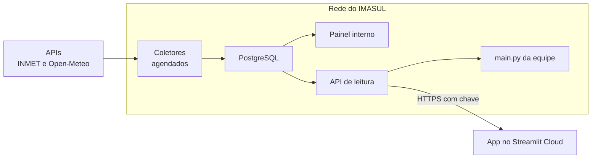

# Plano: do painel na nuvem ao servidor da UNIGEO com banco próprio

> Escrito em 07/10/2026. Registra a ordem de execução para levar o projeto ao servidor da UNIGEO,
> com os dados no PostgreSQL da unidade e uma API de leitura na frente dele. As decisões que
> levaram até aqui (as fontes, o armazenamento, as duas instalações, a API) estão em
> [`escopo_v0.3.1.md`](escopo_v0.3.1.md). Este documento é o roteiro, não as razões.

## Aonde se quer chegar

- **Os coletores** buscam no INMET (o Brasil inteiro, de hora em hora) e no Open-Meteo (MS, duas
  vezes por dia) e gravam no banco.
- **O painel interno** lê o banco direto.
- **A API de leitura** atende o `main.py` nas máquinas da equipe e, se a gerência e a TI aprovarem,
  o app do Streamlit Cloud. O banco nunca fica exposto.
- **No código, quem decide de onde vêm os dados é o `modulos/fonte.py`**, pela configuração de cada
  instalação: as APIs públicas (como hoje), o banco ou a API de leitura. O resto do código não sabe
  a diferença.

## A regra que vale para todas as etapas

**A equipe nunca fica sem a ferramenta que usa hoje.** Cada peça nova entra ao lado do que já
funciona, é comparada com ele e só depois o substitui. É o que foi feito ao levar as estações
vizinhas para os produtos, comparando pixel a pixel. Até a última etapa, o `main.py` e o painel na
nuvem continuam indo direto às APIs.

## Fase 0: o que depende de outras pessoas

| Item | Situação (07 a 09/10) |
|---|---|
| A VM | **Windows**, com acesso do programador. **O Docker não está rodando nela**: por ora, o painel e os coletores rodam direto no Windows (ver abaixo) |
| A VM alcança o INMET | **sim** |
| A VM alcança o banco | **sim** (09/10): uma aplicação que já roda nela usa o banco |
| A VM alcança o Open-Meteo | **sim** (09/10): os quatro endereços que o painel usa (a previsão, a API sazonal e os metadados das duas) responderam HTTP 200 no PowerShell, com `Invoke-WebRequest`. Se o Python falhar lá mais tarde, é o proxy, que ele lê de outro lugar |
| Versão do Windows da VM | **Windows Server 2022** (09/10): recente o bastante para o Python 3.14 |
| Versão do PostgreSQL e extensões disponíveis | **PostgreSQL 16.3**, com **PostGIS 3.4.4** ativo; sem `pg_partman`, `pg_cron` nem `timescaledb` (09/10, ver abaixo) |
| Quem cria e mantém a API de leitura | **o programador**, na máquina host, que alcança o banco e a VM ao mesmo tempo |
| A TI aceita publicar a API por HTTPS para fora? | **sim** (09/10). Fica a "opção 2 com API"; a opção 3 (cópia na nuvem) sai da mesa |
| A gerência quer uma versão externa? | **sim** (09/10). A fase 4 vai até o passo 11, a publicação para fora |

### O que a versão do banco muda

Consultado em 09/10 pela conexão de teste: **PostgreSQL 16.3** (Linux, 64 bits), com o **PostGIS
3.4.4** ativo no banco (e o `postgis_raster` e o `postgis_topology`). A consulta de 07/10, que
dava o 11.14 com o PostGIS 2.5.3, tinha sido feita noutro banco, que não é o do projeto.

**O que a 16 tem e o plano usa:**
- tabelas particionadas, com chave primária na tabela inteira e `INSERT ... ON CONFLICT`
  funcionando nelas. É o que permite atualizar as últimas 48 h do INMET;
- `COPY` direto na tabela particionada;
- partições que se desanexam sem travar a tabela (`DETACH PARTITION ... CONCURRENTLY`): a
  limpeza da grade não segura quem está lendo;
- colunas calculadas pelo banco: a geometria de cada estação sai da latitude e da longitude;
- chaves estrangeiras apontando para tabelas particionadas.

**O que continua igual:**
- **Sem `pg_partman` e sem `pg_cron`, quem cuida das partições é o coletor.** A cada execução ele
  cria as partições que vêm e apaga as que passaram do prazo. O agendamento fica no servidor,
  junto dos coletores, e não no banco.
- **O PostGIS é um bônus, não uma dependência.** Ele permite guardar estações e pontos da grade
  com geometria e perguntar, por exemplo, quais caem dentro de MS.
- **O fuso do servidor é `America/Cuiaba`**, o mesmo de MS. As horas são gravadas com fuso
  (`timestamptz`), em UTC, e o fuso do servidor não muda nada nelas.

A 16 tem suporte até novembro de 2028.

## Fase 1: a fundação, sem mudar nada para a equipe

**1. `modulos/fonte.py`, com uma fonte só: as APIs públicas, como hoje.** O painel e o `main.py`
passam a pedir os dados a ele, e não mais direto ao INMET.
- *Como confirmar:* rodar os dois produtos antes e depois; as saídas têm de ser idênticas, pixel a
  pixel e célula a célula.

**2. `modulos/openmeteo.py` e os testes.** É o passo 1 do escopo da v0.3.1: os pontos da grade e
das estações, os três modelos, a rodada e os pedidos de até 600 chamadas por minuto.
- *Como confirmar:* os testes com o Open-Meteo simulado, e uma busca de verdade para medir o custo
  do dado horário e quanto a máxima tirada das horas fica abaixo da do próprio Open-Meteo.
- *Feito em 07/10.* O horário custa o mesmo que o diário, e a máxima das horas é igual à do
  Open-Meteo (diferença de 0,0 °C nos 14 dias). A busca de MS a 0,5° levou 12 s; os números estão
  no escopo da v0.3.1.

## Fase 2: o banco e os coletores

**3. `banco/esquema.sql` e `modulos/banco.py`.**
- As tabelas: o cadastro de estações, as leituras horárias do INMET, a previsão horária em duas
  tabelas (a da grade, com partições por dia de coleta, apagadas depois de 21 dias; a das
  estações, com partições por mês, para sempre; uma *view* junta as duas) e as semanas do EC46. **Só as horas** (decidido em 09/10): o dia,
  a semana e o mês saem delas na leitura, pela regra do Python. Para o DBeaver, *views* de dias e
  meses, com um teste que confere que dão o mesmo que o Python. O EC46 é a exceção: chega por
  semana, com a anomalia já calculada, e é guardado assim.
- **Tudo num schema próprio, `climageo`** (decidido em 09/10).
- Dois usuários no banco: um que grava, para os coletores, e um que só lê, para a API e o painel.
  **Eles já existem** (09/10), e quem os administra é o programador. Um cuidado: o coletor cria e
  apaga as partições sozinho, e o PostgreSQL só deixa fazer isso o dono da tabela; as tabelas
  devem ser criadas pelo usuário que grava, ou passadas para ele.
- A gravação em lote (`COPY`) e a atualização das últimas 48 h do INMET.
- **A bateria e a sensação térmica** (`TEN_BAT`, `TEM_SEN`, `TEM_CPU`) não vêm no endereço do
  INMET por hora. O coletor as busca por estação **uma vez por dia** (decidido em 09/10): umas 740
  consultas a mais por dia, espalhadas.
- **Feito em 09/10, na v0.4.1:** o `banco/esquema.sql` e o `modulos/banco.py`, com 15 testes que
  passam contra o `climageo_teste` no servidor de verdade. Uma rodada real da grade do ECMWF
  (59.808 linhas) grava em 1,3 s, volta em 0,2 s e ocupa 12 MB, com o índice: uns 200 bytes por
  linha. Na grade de 0,25° com duas rodadas por dia, os 21 dias ficam em ~4 GB (o escopo
  estimava ~3 GB); com as quatro rodadas de cada modelo, em ~8 GB. O passo 5 decide quais rodadas
  o coletor guarda.
- *Como confirmar:* testes contra um PostgreSQL de verdade, de dois jeitos: o GitHub Actions sobe
  um PostgreSQL 16 com PostGIS só para os testes, e na máquina do programador, que é a mesma do
  DBeaver, os testes usam um schema de teste no servidor de verdade (`climageo_teste`), com a
  conexão no `.env`.

**4. O coletor do INMET**, em três passos:
1. Testar o endereço que devolve todas as estações de uma hora (`/estacao/dados/{data}/{hora}`).
   Ele não é documentado: os dados dele têm de bater com os da consulta por estação. **Feito em
   09/10:** com o token, 740 estações de uma hora em 0,8 s. Os valores batem com a consulta por
   estação, salvo a radiação, que vem com três casas em vez de uma. Faltam três campos: a
   sensação térmica, a bateria e a temperatura do processador (ver o passo 3).
2. O coletor de hora em hora, que rebusca as últimas 48 h e atualiza o que mudou.
3. A carga do histórico. Desde 2018 são umas 75 mil consultas de ~1 s (uma por hora, para o
   Brasil inteiro): umas 21 horas de execução, uma vez só.

**5. O coletor do Open-Meteo.** Confere a rodada mais recente de cada modelo, busca se ela ainda
não está no banco, grava as horas (e, uma vez por dia, as semanas do EC46), e apaga as
partições que passaram de 21 dias na grade.

**6. Rodar em paralelo por alguns dias.**
- *Como confirmar:* o banco contra as APIs, dia a dia, até baterem.

## Fase 3: o servidor interno no ar

**7. O `fonte.py` ganha a fonte "banco".**
- *Como confirmar:* os produtos e o painel lendo do banco dão o mesmo resultado que lendo das
  APIs.

**8. A instalação na VM, direto no Windows, sem Docker** (decidido em 07/10, porque o Docker não
está rodando na VM).
- O Python 3.14 e o Git instalados na VM; o repositório clonado numa pasta fixa; um ambiente
  virtual com o `app/requirements.txt`; o `.env` com o token e, depois, a conexão do banco. É o
  mesmo jeito de rodar das máquinas de desenvolvimento.
- **O painel** roda com `streamlit run app\explorador.py --server.port 8501 --server.address 0.0.0.0`,
  e a equipe acessa por `http://<nome-da-VM>:8501`. A porta precisa estar liberada no firewall do
  Windows, só para a rede interna.
- **Para continuar no ar depois de um reinício**, o painel sobe por uma tarefa do **Agendador de
  Tarefas do Windows**, "ao iniciar o computador", que roda mesmo sem ninguém conectado e se
  reinicia se cair. A tarefa chama o **`servidor\iniciar_painel.bat`** (pronto desde 07/10), que
  sobe o painel com o observador de arquivos desligado e grava a saída em `logs\painel.log`.
- **Os coletores** também vão pelo Agendador de Tarefas: o do INMET de hora em hora, o do
  Open-Meteo duas vezes por dia.
- **Para atualizar**, o mesmo caminho de sempre (`git fetch`, mudar para a tag escolhida, instalar
  o que faltar) e reiniciar a tarefa do painel, porque o Streamlit não recarrega os módulos sozinho.
- **O Docker fica para depois**, se a TI ativar containers Linux na VM ou oferecer uma VM Linux. O
  `Dockerfile` e o `docker-compose.yml` só entram no repositório quando houver onde usá-los.

**Marco: o painel interno funcionando na rede da unidade.**

## Fase 4: a API de leitura

**9. A API, só de leitura.** As perguntas que o painel e o `main.py` fazem viram os endereços dela;
esse é o contrato. Ela tem chave, limite de pedidos e respostas enxutas: o mapa de um dia, com 607
valores, e não a tabela crua de uma rodada. Entra no banco pelo usuário que só lê. Criada e mantida
pelo programador.

**10. O `fonte.py` ganha a fonte "API de leitura", e o `main.py` da equipe passa a usá-la**, por
enquanto só dentro da rede.
- Com isso, **o token do INMET sai das máquinas da equipe** e fica só no servidor. É o momento de
  pedir ao INMET a troca do token.

**11. A publicação para fora**, se a gerência e a TI aprovarem: HTTPS, um endereço próprio e a
regra no firewall ou no proxy. Feita ela, o app do Streamlit Cloud troca de fonte só nos Secrets,
sem mexer no código. **Até lá, a nuvem segue indo direto às APIs.**

## Onde entra a página de previsão

**Logo depois do passo 2, sem esperar o banco.** Na v0.3.x a página busca no Open-Meteo sob
demanda, com a cópia guardada por rodada e compartilhada (decisões 7 e 11 do escopo), em qualquer
instalação. Assim a equipe vê resultado novo enquanto a infraestrutura segue. **Os gráficos por
estação, os mapas dos dias, os das semanas e o risco de fogo previsto estão prontos desde
08/10**: os seis passos do escopo da v0.3.1.

Quando o coletor do Open-Meteo estiver gravando (passo 5) e o `fonte.py` souber ler do banco
(passo 7), a página **no servidor interno** passa a ler do banco, com a grade de 0,25°. **Na nuvem**
ela continua sob demanda, a 0,5°, até a publicação da API (passo 11).

## Em versões

| Versão | O que entra |
|---|---|
| **v0.3.x** | a fase 1 e a página de previsão sob demanda |
| **v0.4.x** | o banco, os dois coletores e o servidor interno no Windows (fases 2 e 3); a página de previsão passa a ler do banco no servidor; o produto de previsão do `main.py` (decidido em 09/10/2026), lendo do banco |
| **v0.5.x** | a API de leitura e a versão externa (fase 4) |

Cada versão entra na `main` por PR, como de costume. O Streamlit Cloud acompanha a `main`; o
servidor interno roda a tag que for escolhida.
