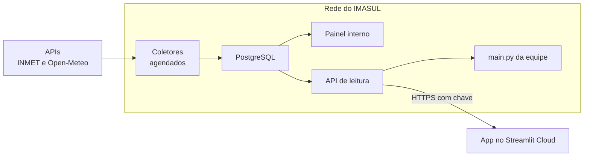

# Plano: do painel na nuvem ao servidor da UNIGEO com banco próprio

> Escrito em 07/10/2026. Registra a ordem de execução para levar o projeto ao servidor da UNIGEO,
> com os dados no PostgreSQL da unidade e uma API de leitura na frente dele. As decisões que
> levaram até aqui (as fontes, o armazenamento, as duas instalações, a API) estão em
> [`escopo_v0.3.1.md`](escopo_v0.3.1.md). Este documento é o roteiro, não as razões.

## Aonde se quer chegar

- **Os coletores** buscam no INMET (o Brasil inteiro, de hora em hora) e no Open-Meteo (MS, duas
  vezes por dia) e gravam no banco.
- **O painel interno** lê o banco direto.
- **A API de leitura** atende o `main.py` nas máquinas da equipe e, se a gerência e a TI aprovarem,
  o app do Streamlit Cloud. O banco nunca fica exposto.
- **No código, quem decide de onde vêm os dados é o `modulos/fonte.py`**, pela configuração de cada
  instalação: as APIs públicas (como hoje), o banco ou a API de leitura. O resto do código não sabe
  a diferença.

## A regra que vale para todas as etapas

**A equipe nunca fica sem a ferramenta que usa hoje.** Cada peça nova entra ao lado do que já
funciona, é comparada com ele e só depois o substitui. É o que foi feito ao levar as estações
vizinhas para os produtos, comparando pixel a pixel. Até a última etapa, o `main.py` e o painel na
nuvem continuam indo direto às APIs.

## Fase 0: o que depende de outras pessoas

| Item | Situação em 07/10 |
|---|---|
| VM com Docker | **pronta**, e o programador já tem acesso |
| A VM alcança o INMET | **sim** |
| A VM alcança o Open-Meteo, inclusive de dentro de um container | a testar, com os comandos `curl` registrados na conversa de 07/10 |
| Versão do PostgreSQL e extensões disponíveis (`pg_partman`, `pg_cron`, `postgis`) | a conferir no DBeaver |
| Quem cria e mantém a API de leitura | **o programador**, na máquina host, que alcança o banco e a VM ao mesmo tempo |
| A TI aceita publicar a API por HTTPS para fora? | a perguntar. Decide entre a "opção 2 com API" e a opção 3 (cópia na nuvem) |
| A gerência quer uma versão externa? | a perguntar. Sem ela, a fase 4 para no passo 10 |

## Fase 1: a fundação, sem mudar nada para a equipe

**1. `modulos/fonte.py`, com uma fonte só: as APIs públicas, como hoje.** O painel e o `main.py`
passam a pedir os dados a ele, e não mais direto ao INMET.
- *Como confirmar:* rodar os dois produtos antes e depois; as saídas têm de ser idênticas, pixel a
  pixel e célula a célula.

**2. `modulos/openmeteo.py` e os testes.** É o passo 1 do escopo da v0.3.1: os pontos da grade e
das estações, os três modelos, a rodada e os pedidos de até 600 chamadas por minuto.
- *Como confirmar:* os testes com o Open-Meteo simulado, e uma busca de verdade para medir o custo
  do dado horário e quanto a máxima tirada das horas fica abaixo da do próprio Open-Meteo.

## Fase 2: o banco e os coletores

**3. `banco/esquema.sql` e `modulos/banco.py`.**
- As tabelas: o cadastro de estações, as leituras do INMET, a previsão horária e a previsão
  diária, com as partições por dia de coleta.
- Dois usuários no banco: um que grava, para os coletores, e um que só lê, para a API e o painel.
- A gravação em lote (`COPY`) e a atualização das últimas 48 h do INMET.
- *Como confirmar:* testes contra um PostgreSQL de verdade, que o GitHub Actions sobe só para os
  testes.

**4. O coletor do INMET**, em três passos:
1. Testar o endereço que devolve todas as estações de uma hora (`/estacao/dados/{data}/{hora}`).
   Ele não é documentado: os dados dele têm de bater com os da consulta por estação.
2. O coletor de hora em hora, que rebusca as últimas 48 h e atualiza o que mudou.
3. A carga do histórico. Desde 2018 são umas 70 mil consultas de ~1 s: algumas horas de
   execução, uma vez só.

**5. O coletor do Open-Meteo.** Confere a rodada mais recente de cada modelo, busca se ela ainda
não está no banco, grava a horária e a diária, e apaga as partições que passaram de 21 dias na
grade.

**6. Rodar em paralelo por alguns dias.**
- *Como confirmar:* o banco contra as APIs, dia a dia, até baterem.

## Fase 3: o servidor interno no ar

**7. O `fonte.py` ganha a fonte "banco".**
- *Como confirmar:* os produtos e o painel lendo do banco dão o mesmo resultado que lendo das
  APIs.

**8. O `Dockerfile` e o `docker-compose.yml`**, com o painel e os coletores, e a subida na VM. O
banco entra só pela conexão, lida do `.env` do servidor.

**Marco: o painel interno funcionando na rede da unidade.**

## Fase 4: a API de leitura

**9. A API, só de leitura.** As perguntas que o painel e o `main.py` fazem viram os endereços dela;
esse é o contrato. Ela tem chave, limite de pedidos e respostas enxutas: o mapa de um dia, com 607
valores, e não a tabela crua de uma rodada. Entra no banco pelo usuário que só lê. Criada e mantida
pelo programador.

**10. O `fonte.py` ganha a fonte "API de leitura", e o `main.py` da equipe passa a usá-la**, por
enquanto só dentro da rede.
- Com isso, **o token do INMET sai das máquinas da equipe** e fica só no servidor. É o momento de
  pedir ao INMET a troca do token.

**11. A publicação para fora**, se a gerência e a TI aprovarem: HTTPS, um endereço próprio e a
regra no firewall ou no proxy. Feita ela, o app do Streamlit Cloud troca de fonte só nos Secrets,
sem mexer no código. **Até lá, a nuvem segue indo direto às APIs.**

## Onde entra a aba de previsão

**Logo depois do passo 2, sem esperar o banco.** Na v0.3.x a aba busca no Open-Meteo sob demanda,
com a cópia guardada por rodada e compartilhada (decisão 7 do escopo), em qualquer instalação.
Assim a equipe vê resultado novo enquanto a infraestrutura segue.

Quando o coletor do Open-Meteo estiver gravando (passo 5) e o `fonte.py` souber ler do banco
(passo 7), a aba **no servidor interno** passa a ler do banco, com a grade de 0,25°. **Na nuvem**
ela continua sob demanda, a 0,5°, até a publicação da API (passo 11).

## Em versões

| Versão | O que entra |
|---|---|
| **v0.3.x** | a fase 1 e a aba de previsão sob demanda |
| **v0.4.x** | o banco, os dois coletores, o Docker e o servidor interno (fases 2 e 3); a aba de previsão passa a ler do banco no servidor |
| **v0.5.x** | a API de leitura e a versão externa (fase 4) |

Cada versão entra na `main` por PR, como de costume. O Streamlit Cloud acompanha a `main`; o
servidor interno roda a tag que for escolhida.
